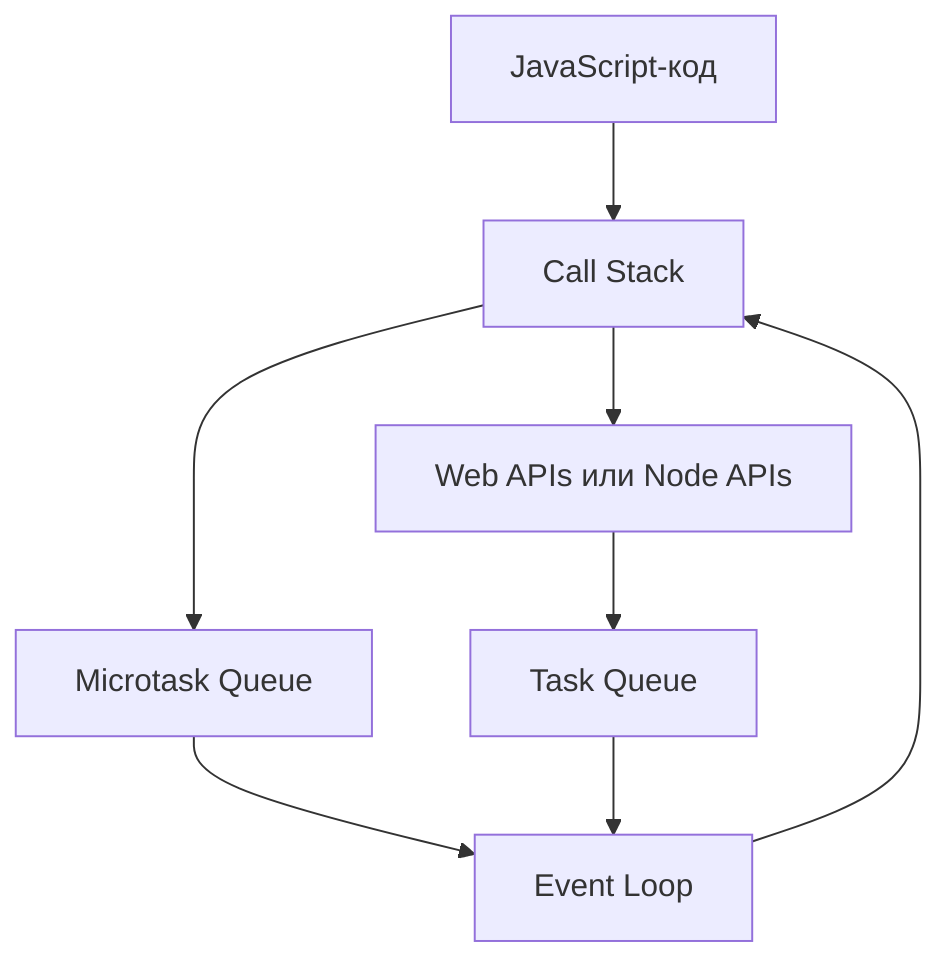

# Асинхронность JavaScript: теория для собеседования

## Что такое асинхронность

JavaScript выполняет код в основном потоке последовательно, но умеет запускать операции, результат которых появится позже: таймеры, сетевые запросы, чтение файлов, события пользователя и обращения к базе данных.

**Асинхронность** позволяет не блокировать выполнение программы во время ожидания таких операций. Это не означает, что весь JavaScript-код автоматически выполняется параллельно.



Главные темы для интервью:

- Call Stack и Event Loop;
- задачи и микрозадачи;
- `Promise`;
- `async/await`;
- `setTimeout` и `setInterval`;
- порядок выполнения логов;
- обработка ошибок;
- конкурентное выполнение и ограничение нагрузки.

---

## 1. Синхронный код и Call Stack

**Call Stack**, или стек вызовов, хранит выполняющиеся функции. JavaScript выполняет верхний элемент стека до завершения.

```js
function second() {
  console.log('second');
}

function first() {
  console.log('first: start');
  second();
  console.log('first: end');
}

first();
```

Результат:

```text
first: start
second
first: end
```

Пока стек занят долгой синхронной задачей, обработчики кликов, таймеры и отрисовка страницы ждут.

```js
const startedAt = Date.now();

while (Date.now() - startedAt < 3000) {
  // Блокируем главный поток на три секунды.
}
```

В браузере такой код замораживает интерфейс. Асинхронный API не делает тяжёлые вычисления неблокирующими: CPU-задачи необходимо разбивать на части или переносить в Web Worker/Worker Thread.

---

## 2. Event Loop

**Event Loop** координирует стек вызовов и очереди отложенной работы. Он позволяет выполнять обработчики после завершения текущего синхронного кода.

Упрощённый цикл в браузере:

1. Выполняется текущая задача и весь синхронный код внутри неё.
2. Когда стек освобождается, выполняются все доступные микрозадачи.
3. Браузер может выполнить рендеринг.
4. Event Loop берёт следующую задачу.
5. Цикл повторяется.

### Task и Microtask

На собеседованиях задачу часто называют **macrotask**, хотя в спецификациях браузера обычно используется термин **task**.

| Очередь | Типичные источники |
| --- | --- |
| Task queue | начальный скрипт, `setTimeout`, `setInterval`, события DOM, сообщения |
| Microtask queue | `.then`, `.catch`, `.finally`, продолжение после `await`, `queueMicrotask`, `MutationObserver` |

Основное правило:

> После завершения текущего синхронного кода Event Loop полностью очищает очередь микрозадач и только потом переходит к следующей задаче.

```js
console.log(1);

setTimeout(() => console.log(2), 0);

Promise.resolve().then(() => console.log(3));

console.log(4);
```

Результат:

```text
1
4
3
2
```

Объяснение:

1. `1` и `4` выводятся синхронно.
2. Обработчик `.then` попадает в очередь микрозадач.
3. `setTimeout` добавляет callback в очередь задач.
4. Микрозадача выполняется раньше следующей задачи.

### Microtask starvation

Если микрозадача бесконечно создаёт новые микрозадачи, браузер не сможет перейти к следующей задаче и отрисовке:

```js
function repeat() {
  queueMicrotask(repeat);
}

repeat();
```

Поэтому большое количество микрозадач тоже способно заблокировать интерфейс.

---

## 3. Promise

**Promise** — объект, представляющий результат асинхронной операции, который уже получен или появится в будущем.

Promise имеет три состояния:

- `pending` — ожидание;
- `fulfilled` — успешное выполнение;
- `rejected` — завершение с ошибкой.

После перехода в `fulfilled` или `rejected` состояние Promise больше не меняется.

```js
const promise = new Promise((resolve, reject) => {
  const success = true;

  if (success) {
    resolve('result');
  } else {
    reject(new Error('operation failed'));
  }
});
```

### Executor выполняется синхронно

Функция, переданная в конструктор `Promise`, запускается сразу:

```js
console.log('start');

new Promise((resolve) => {
  console.log('executor');
  resolve();
}).then(() => console.log('then'));

console.log('end');
```

Результат:

```text
start
executor
end
then
```

Executor синхронный, но обработчик `.then` всегда выполняется асинхронно как микрозадача.

### `.then` возвращает новый Promise

Это позволяет строить цепочки:

```js
fetchUser()
  .then((user) => fetchOrders(user.id))
  .then((orders) => calculateTotal(orders))
  .then((total) => console.log(total))
  .catch((error) => console.error(error));
```

Значение, возвращённое из обработчика, становится результатом следующего Promise:

```js
Promise.resolve(2)
  .then((value) => value * 2)
  .then((value) => console.log(value)); // 4
```

Если вернуть Promise, цепочка дождётся его результата:

```js
getUser()
  .then((user) => getProfile(user.id))
  .then((profile) => console.log(profile));
```

Частая ошибка — забыть `return`:

```js
getUser()
  .then((user) => {
    getProfile(user.id); // Promise потерян.
  })
  .then((profile) => {
    console.log(profile); // undefined
  });
```

### Обработка ошибок

Ошибка, выброшенная внутри `.then`, превращается в отклонённый Promise:

```js
Promise.resolve()
  .then(() => {
    throw new Error('failed');
  })
  .catch((error) => {
    console.error(error.message);
  });
```

`.catch(handler)` эквивалентен `.then(undefined, handler)` и перехватывает ошибки предыдущей части цепочки.

`.finally` выполняется независимо от результата и обычно не изменяет передаваемое дальше значение:

```js
request()
  .then(handleResult)
  .catch(handleError)
  .finally(hideLoader);
```

Если `finally` выбросит ошибку или вернёт отклонённый Promise, эта новая ошибка заменит предыдущий результат.

### Что произойдёт при нескольких вызовах

Учитывается только первый вызов `resolve` или `reject`:

```js
new Promise((resolve, reject) => {
  resolve('success');
  reject(new Error('ignored'));
  resolve('also ignored');
});
```

---

## 4. Методы Promise

### `Promise.all`

Ожидает успешного завершения всех Promise и возвращает результаты в исходном порядке.

```js
const [user, orders] = await Promise.all([
  fetchUser(),
  fetchOrders(),
]);
```

Если один Promise отклоняется, итоговый Promise сразу отклоняется. Остальные операции автоматически не отменяются.

Используется, когда нужны все результаты и операции независимы.

### `Promise.allSettled`

Ждёт завершения всех операций и возвращает их статусы:

```js
const results = await Promise.allSettled([
  sendEmail(),
  updateAnalytics(),
]);
```

Используется, когда нужно узнать результат каждой операции, даже если некоторые завершились ошибкой.

### `Promise.race`

Завершается с результатом первого **завершившегося** Promise — успешного или отклонённого.

```js
const result = await Promise.race([
  request(),
  timeout(5000),
]);
```

`Promise.race` сам по себе не отменяет проигравшие операции.

### `Promise.any`

Возвращает первый успешно выполненный Promise. Ошибки игнорируются, пока остаётся возможность получить успешный результат. Если отклонены все Promise, результатом будет `AggregateError`.

```js
const response = await Promise.any([
  requestFromMirrorA(),
  requestFromMirrorB(),
]);
```

### Сравнение

| Метод | Когда завершается | Результат при ошибке |
| --- | --- | --- |
| `Promise.all` | Все успешны | Первая ошибка отклоняет общий Promise |
| `Promise.allSettled` | Завершились все | Ошибки входят в массив результатов |
| `Promise.race` | Завершился первый | Первый результат может быть ошибкой |
| `Promise.any` | Первый успешный | `AggregateError`, если ошиблись все |

---

## 5. `async/await`

`async/await` — синтаксис для работы с Promise, который делает асинхронный код похожим на последовательный.

### `async` всегда возвращает Promise

```js
async function getNumber() {
  return 42;
}

getNumber().then(console.log); // 42
```

Если `async`-функция выбрасывает ошибку, возвращаемый Promise становится отклонённым:

```js
async function fail() {
  throw new Error('failed');
}
```

### Что делает `await`

`await` приостанавливает только текущую `async`-функцию, а не весь поток JavaScript. Продолжение функции после `await` выполняется как микрозадача.

```js
async function run() {
  console.log('A');
  await Promise.resolve();
  console.log('B');
}

console.log('C');
run();
console.log('D');
```

Результат:

```text
C
A
D
B
```

Даже `await` обычного значения отдаёт управление и продолжает выполнение асинхронно:

```js
await 10;
```

Концептуально значение оборачивается через `Promise.resolve`.

### Обработка ошибок через `try/catch`

```js
async function loadData() {
  try {
    const response = await fetch('/api/data');

    if (!response.ok) {
      throw new Error(`HTTP ${response.status}`);
    }

    return await response.json();
  } catch (error) {
    console.error(error);
    throw error;
  } finally {
    hideLoader();
  }
}
```

Важно: `fetch` отклоняется при сетевой ошибке или отмене, но обычно не отклоняется из-за HTTP-статусов `404` или `500`. Их нужно проверять через `response.ok` или `response.status`.

### Последовательное и параллельное ожидание

Последовательный вариант:

```js
const user = await fetchUser();
const orders = await fetchOrders();
```

Второй запрос начнётся только после первого.

Конкурентный вариант:

```js
const userPromise = fetchUser();
const ordersPromise = fetchOrders();

const [user, orders] = await Promise.all([
  userPromise,
  ordersPromise,
]);
```

Если операции независимы, второй вариант обычно быстрее.

---

## 6. `setTimeout` и `setInterval`

### `setTimeout`

```js
const timerId = setTimeout(() => {
  console.log('done');
}, 1000);

clearTimeout(timerId);
```

Задержка означает минимальное время ожидания, а не точный момент запуска. Callback выполнится только когда:

1. истечёт задержка;
2. callback попадёт в очередь задач;
3. освободится стек;
4. будут выполнены накопившиеся микрозадачи;
5. Event Loop выберет эту задачу.

Поэтому `setTimeout(callback, 0)` не запускает callback немедленно.

### `setInterval`

```js
const intervalId = setInterval(() => {
  console.log('tick');
}, 1000);

clearInterval(intervalId);
```

Проблемы `setInterval`:

- длительная операция может выполняться дольше интервала;
- интервалы могут смещаться из-за занятости главного потока;
- асинхронные вызовы могут накладываться друг на друга;
- забытый интервал создаёт утечку ресурсов и нежелательные действия после уничтожения компонента.

Для повторяющейся асинхронной операции безопаснее рекурсивный `setTimeout`:

```js
let stopped = false;

async function poll() {
  try {
    await updateData();
  } finally {
    if (!stopped) {
      setTimeout(poll, 1000);
    }
  }
}

poll();

// Для остановки:
stopped = true;
```

Следующий вызов планируется после завершения предыдущего, поэтому запросы не накладываются.

### Почему таймер может сработать позже

```js
setTimeout(() => console.log('timer'), 100);

const start = Date.now();
while (Date.now() - start < 2000) {}
```

Callback выполнится примерно через две секунды, потому что стек был занят синхронным циклом.

---

## 7. Браузер и Node.js

Принцип Event Loop одинаков: синхронный код выполняется первым, а отложенная работа попадает в очереди. Однако конкретные окружения имеют разные API и фазы цикла.

### Браузер

Основные источники задач:

- таймеры;
- DOM-события;
- сообщения;
- сетевые события.

Между задачами браузер может выполнять рендеринг.

### Node.js

Node.js использует libuv и несколько фаз Event Loop, среди которых:

- timers;
- pending callbacks;
- poll;
- check;
- close callbacks.

Особенности:

- `setImmediate` выполняется в фазе `check`;
- `setTimeout` — в фазе `timers`;
- `process.nextTick` использует специальную очередь, которая обрабатывается раньше обычных Promise-микрозадач;
- порядок `setTimeout(..., 0)` и `setImmediate` на верхнем уровне нельзя считать универсально гарантированным;
- внутри callback ввода-вывода `setImmediate` обычно выполняется раньше таймера с нулевой задержкой.

```js
const fs = require('node:fs');

fs.readFile(__filename, () => {
  setTimeout(() => console.log('timeout'), 0);
  setImmediate(() => console.log('immediate'));
});
```

Ожидаемый порядок внутри I/O-callback:

```text
immediate
timeout
```

Нельзя переносить детали Node.js Event Loop один к одному на браузер.

---

## 8. Отмена асинхронных операций

Promise не имеет универсального встроенного метода `cancel`. Операцию должен поддерживать конкретный API.

Для `fetch` используется `AbortController`:

```js
const controller = new AbortController();

const promise = fetch('/api/data', {
  signal: controller.signal,
});

controller.abort();
```

Отмену важно использовать при:

- размонтировании компонента;
- изменении поискового запроса;
- превышении таймаута;
- потере актуальности результата.

Пример таймаута:

```js
async function fetchWithTimeout(url, timeoutMs) {
  const controller = new AbortController();
  const timerId = setTimeout(() => controller.abort(), timeoutMs);

  try {
    return await fetch(url, { signal: controller.signal });
  } finally {
    clearTimeout(timerId);
  }
}
```

---

## 9. Race condition и устаревшие ответы

Асинхронные операции могут завершаться не в порядке запуска.

```js
search('react');     // Медленный запрос.
search('react 19');  // Быстрый запрос.
```

Если первый запрос завершится позже второго, он может перезаписать актуальные данные устаревшими.

Способы решения:

- отменять предыдущий запрос через `AbortController`;
- использовать идентификатор последнего запроса;
- проверять актуальность результата перед обновлением состояния;
- применять библиотеку управления серверным состоянием, которая отслеживает ключи запросов.

```js
let latestRequestId = 0;

async function search(query) {
  const requestId = ++latestRequestId;
  const result = await apiSearch(query);

  if (requestId === latestRequestId) {
    render(result);
  }
}
```

---

## 10. Ограничение конкурентности

Запуск тысячи запросов через один `Promise.all` может перегрузить клиент, сервер или базу данных.

```js
await Promise.all(items.map(processItem));
```

Для больших наборов используют пул с ограничением конкурентности, например по 5–10 операций одновременно.

Простой worker pool:

```js
async function mapWithLimit(items, limit, worker) {
  const results = new Array(items.length);
  let nextIndex = 0;

  async function runWorker() {
    while (nextIndex < items.length) {
      const index = nextIndex++;
      results[index] = await worker(items[index], index);
    }
  }

  const workers = Array.from(
    { length: Math.min(limit, items.length) },
    runWorker,
  );

  await Promise.all(workers);
  return results;
}
```

---

## 11. Частые ошибки

### `forEach` не ждёт `async` callback

```js
items.forEach(async (item) => {
  await save(item);
});

console.log('finished'); // Выполнится до завершения save.
```

Последовательно:

```js
for (const item of items) {
  await save(item);
}
```

Конкурентно:

```js
await Promise.all(items.map(save));
```

### `await` внутри `map` возвращает массив Promise

```js
const results = items.map(async (item) => process(item));
```

`results` — массив Promise, а не готовых результатов. Нужно:

```js
const results = await Promise.all(
  items.map((item) => process(item)),
);
```

### Потерянный Promise

```js
async function handler() {
  saveData(); // Ошибка может стать unhandled rejection.
}
```

Если результат важен, используйте `await` или `return`. Если запускаете операцию намеренно без ожидания, явно обработайте ошибку:

```js
void saveData().catch(reportError);
```

### `new Promise(async (...) => {})`

```js
new Promise(async (resolve, reject) => {
  const result = await request();
  resolve(result);
});
```

Обычно это антипаттерн. `async` уже возвращает Promise, а ошибки async-executor могут обрабатываться неожиданно.

Лучше:

```js
const result = await request();
```

Создавать `new Promise` нужно в основном при оборачивании callback API или самостоятельном управлении моментом `resolve`/`reject`.

### Последовательный `await` без необходимости

```js
const a = await getA();
const b = await getB();
```

Если операции независимы:

```js
const [a, b] = await Promise.all([getA(), getB()]);
```

### `Promise.all` не отменяет остальные операции

При ошибке одного запроса остальные продолжают работать, если явно не реализована отмена.

### Забытый `clearInterval`

Интервал продолжает работать после того, как его результат больше не нужен. В React таймер очищают в cleanup-функции эффекта.

---

## 12. Вопросы и короткие ответы для интервью

### JavaScript однопоточный?

Выполнение JavaScript-кода в одном контексте обычно происходит в одном основном потоке. Окружение может выполнять I/O и другую работу вне этого потока, а результаты возвращаются через Event Loop. Для вычислительного параллелизма существуют Web Workers и Worker Threads.

### Асинхронность и многопоточность — одно и то же?

Нет. Асинхронность описывает организацию ожидания и продолжения работы, а многопоточность — одновременное выполнение в нескольких потоках.

### Что выполняется раньше: Promise или `setTimeout(..., 0)`?

После текущего синхронного кода обработчик Promise выполняется раньше, потому что это микрозадача, а callback таймера — следующая задача.

### Почему `setTimeout(..., 0)` не выполняется сразу?

Он только планирует callback на будущую задачу. Callback ждёт освобождения стека и выполнения всех микрозадач.

### Выполняется ли executor Promise асинхронно?

Нет, executor запускается синхронно при создании Promise. Обработчики `.then`, `.catch` и `.finally` выполняются асинхронно.

### Что возвращает `.then`?

Новый Promise. Его результат зависит от значения или ошибки, возвращённых обработчиком.

### Что возвращает `async`-функция?

Всегда Promise. Обычное возвращённое значение становится fulfilled-результатом, а выброшенная ошибка — rejected-результатом.

### Блокирует ли `await` поток?

Нет. Он приостанавливает только текущую `async`-функцию и позволяет продолжить выполнение другого кода.

### В чём разница между `Promise.all` и `Promise.allSettled`?

`Promise.all` отклоняется при первой ошибке и подходит, когда нужны все успешные результаты. `Promise.allSettled` ждёт все операции и возвращает статус каждой.

### Как отменить Promise?

Сам Promise не отменяется универсальным способом. Нужно использовать механизм конкретного API, например `AbortController` для `fetch` или `clearTimeout` для таймера.

### Что такое unhandled rejection?

Это отклонённый Promise, для которого вовремя не был установлен обработчик ошибки. Такое состояние нужно логировать и предотвращать через `catch`, `await` с `try/catch` или возврат Promise вызывающему коду.

### Что такое race condition?

Ситуация, когда результат зависит от непредсказуемого порядка завершения асинхронных операций. Например, старый сетевой запрос может завершиться позже нового и перезаписать актуальное состояние.

### Почему нельзя делать бесконечную цепочку микрозадач?

Event Loop очищает очередь микрозадач перед следующей задачей. Если микрозадачи непрерывно создают новые микрозадачи, таймеры, события и рендеринг не получат управление.

---

## 13. Чек-лист подготовки

Перед собеседованием нужно уметь:

- объяснить Call Stack и Event Loop;
- различать задачи и микрозадачи;
- определить порядок логов с Promise, `await` и таймерами;
- объяснить три состояния Promise;
- строить и возвращать корректные Promise-цепочки;
- использовать `.then`, `.catch` и `.finally`;
- сравнить `all`, `allSettled`, `race` и `any`;
- объяснить, что возвращает `async` и как работает `await`;
- отличить последовательное выполнение от конкурентного;
- объяснить неточность таймеров;
- правильно остановить таймер или сетевой запрос;
- распознать race condition и устаревший ответ;
- ограничить количество одновременно выполняемых операций;
- назвать различия Event Loop браузера и Node.js;
- исправить `forEach(async ...)`, потерянный `return` и потерянный Promise.

## Краткий ответ для собеседования

> JavaScript выполняет синхронный код через Call Stack, а асинхронные операции обслуживаются окружением браузера или Node.js. После завершения операции её callback планируется в соответствующей очереди, а Event Loop переносит его в стек, когда тот свободен. После текущего синхронного кода сначала полностью выполняются микрозадачи — Promise, продолжения `await` и `queueMicrotask`, — а затем следующая задача, например `setTimeout`. Promise представляет будущий результат операции, а `async/await` предоставляет более удобный синтаксис работы с Promise.
