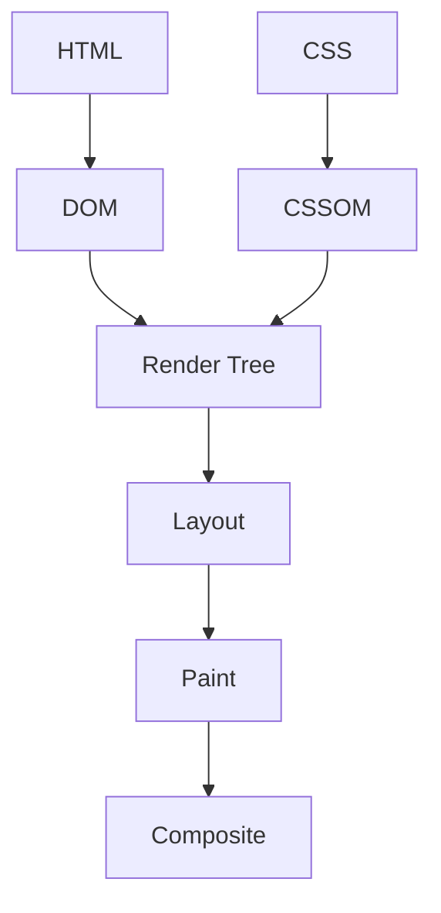

# Critical Rendering Path

## Что это такое

**Critical Rendering Path (CRP)** — это последовательность этапов, которые браузер проходит от получения HTML, CSS и JavaScript до появления пикселей на экране.

Упрощённо процесс выглядит так:



Основная цепочка:

> HTML → DOM + CSS → CSSOM → Render Tree → Layout → Paint → Composite

Пока браузер не получил достаточно данных для этой цепочки, пользователь не увидит корректно отрисованную страницу.

---

## 1. DOM

**DOM (Document Object Model)** — объектное дерево, построенное браузером на основе HTML.

Исходный HTML:

```html
<body>
  <main>
    <h1>Critical Rendering Path</h1>
    <p>Как браузер отображает страницу</p>
  </main>
</body>
```

Браузер превращает его в дерево объектов:

```text
Document
└── html
    └── body
        └── main
            ├── h1
            └── p
```

### Как строится DOM

1. Браузер получает HTML в виде байтов.
2. Преобразует байты в символы.
3. Формирует токены: `html`, `body`, `h1` и другие.
4. Создаёт узлы и связывает их в дерево DOM.

HTML разбирается постепенно. Браузеру не обязательно ждать загрузки всего документа, чтобы начать строить DOM.

### Как JavaScript влияет на DOM

Обычный скрипт без `defer`, `async` или `type="module"` может остановить HTML-парсер:

```html
<script src="app.js"></script>
```

Браузер должен загрузить и выполнить такой скрипт, потому что он может изменить текущий DOM через `document.write`, добавить элементы или удалить уже созданные узлы.

Скрипт с `defer` загружается параллельно с HTML и выполняется после построения DOM:

```html
<script defer src="app.js"></script>
```

---

## 2. CSSOM

**CSSOM (CSS Object Model)** — дерево CSS-правил, построенное браузером на основе всех применимых стилей.

Пример CSS:

```css
body {
  font-family: sans-serif;
}

h1 {
  color: purple;
}
```

Браузер разбирает селекторы, каскад, наследование и специфичность, чтобы определить итоговые стили каждого элемента.

### Почему CSS блокирует рендеринг

Браузер не может корректно построить Render Tree, пока не узнает стили элементов. Например, CSS может содержать:

```css
h1 {
  display: none;
}
```

Без этого правила браузер мог бы отрисовать заголовок, а затем сразу убрать его. Чтобы избежать некорректного промежуточного отображения, внешние таблицы стилей обычно считаются **render-blocking resources**.

```html
<link rel="stylesheet" href="styles.css" />
```

CSS также может задерживать выполнение JavaScript, если скрипт обращается к вычисленным стилям элементов.

---

## 3. Render Tree

**Render Tree** — дерево только тех визуальных объектов, которые необходимо отобразить на странице.

Оно создаётся на основе DOM и CSSOM:

```text
DOM + CSSOM → Render Tree
```

Для каждого видимого DOM-узла браузер определяет вычисленные стили и создаёт соответствующий объект рендеринга.

### Render Tree не является копией DOM

- Элементы с `display: none` не попадают в Render Tree и не занимают место.
- Содержимое `<head>`, `<script>` и `<meta>` не отображается и обычно не входит в Render Tree.
- Псевдоэлементы `::before` и `::after` могут присутствовать в Render Tree, хотя отдельных узлов DOM для них нет.
- Элемент с `visibility: hidden` участвует в Layout и занимает место, но при Paint остаётся невидимым.

---

## 4. Layout

**Layout**, или **Reflow**, — вычисление геометрии элементов: их размеров и положения на странице.

На этом этапе браузер определяет:

- ширину и высоту элементов;
- координаты относительно родительских элементов;
- отступы, рамки и размеры контента;
- перенос строк;
- расположение элементов во Flexbox и Grid;
- влияние размеров окна и медиазапросов.

Например, значение `width: 50%` ещё не является готовым числом. Во время Layout браузер вычисляет конкретную ширину в пикселях на основе размера родителя.

### Что может вызвать повторный Layout

- изменение `width`, `height`, `margin` или `padding`;
- добавление или удаление элементов;
- изменение текста;
- загрузка шрифта;
- изменение размеров окна;
- чтение некоторых геометрических свойств после изменения DOM.

Пример нежелательного чередования записи и чтения:

```js
element.style.width = '200px';
const width = element.offsetWidth;
element.style.width = `${width + 10}px`;
```

Чтение `offsetWidth` может заставить браузер немедленно выполнить отложенные расчёты Layout. Частое повторение такого сценария называется **layout thrashing**.

---

## 5. Paint

**Paint** — преобразование рассчитанных визуальных элементов в команды рисования.

Браузер отрисовывает:

- фон;
- текст;
- изображения;
- границы;
- тени;
- градиенты;
- декоративные элементы.

Layout отвечает на вопрос **«где и какого размера находится элемент?»**, а Paint — **«как этот элемент выглядит?»**.

### Что может вызвать повторный Paint

Изменение визуального свойства, которое не влияет на геометрию, обычно не требует Layout, но может потребовать Paint:

```css
.button {
  background-color: red;
  color: white;
  box-shadow: 0 4px 12px rgb(0 0 0 / 20%);
}
```

К затратной перерисовке могут приводить большие тени, сложные градиенты, фильтры и изменение оформления крупных областей страницы.

---

## 6. Composite

После Paint браузер может разделить страницу на отдельные слои. На этапе **Composite** эти слои собираются в итоговое изображение в правильном порядке.

Некоторые изменения можно выполнить на этапе композиции, не запуская повторные Layout и Paint:

```css
.card {
  transform: translateX(20px);
  opacity: 0.8;
}
```

Поэтому для плавных анимаций обычно рекомендуется изменять `transform` и `opacity`. Они часто обрабатываются композитором и могут эффективно выполняться с участием GPU.

Однако `will-change` нельзя добавлять ко всем элементам: лишние слои увеличивают потребление памяти.

---

## Первый рендер и последующие обновления

Полная цепочка особенно важна при первой загрузке:

```text
DOM + CSSOM → Render Tree → Layout → Paint → Composite
```

После изменения страницы браузер выполняет только необходимые этапы:

| Изменение | Возможные этапы |
| --- | --- |
| Добавление элемента | Render Tree → Layout → Paint → Composite |
| Изменение `width` | Layout → Paint → Composite |
| Изменение `background-color` | Paint → Composite |
| Изменение `transform` или `opacity` | Часто только Composite |

Чем раньше этап в цепочке, тем больше последующей работы он обычно вызывает.

---

## Как оптимизировать Critical Rendering Path

### HTML и DOM

- Уменьшать количество и глубину DOM-узлов.
- Не размещать синхронные тяжёлые скрипты в `<head>`.
- Использовать `defer` для скриптов, которым не требуется останавливать HTML-парсер.
- Разбивать тяжёлые вычисления, чтобы они не блокировали главный поток.

### CSS

- Удалять неиспользуемые стили.
- Минифицировать CSS.
- Встраивать небольшой критический CSS для первого экрана.
- Загружать некритические стили позже.
- Не использовать `@import` для основных стилей, поскольку он создаёт дополнительную цепочку загрузок.

### Сеть и ресурсы

- Использовать кеширование, сжатие Brotli или Gzip и CDN.
- Применять `preload` только для действительно критических ресурсов.
- Предварительно подключаться к важным сторонним доменам через `preconnect`.
- Загружать изображения ниже первого экрана с `loading="lazy"`.
- Указывать размеры изображений, чтобы уменьшить сдвиги Layout.
- Предзагружать критические шрифты и использовать подходящий `font-display`.

### Layout, Paint и анимации

- Группировать чтения и записи DOM, чтобы избежать layout thrashing.
- Не изменять геометрические свойства в каждом кадре анимации.
- Для анимаций предпочитать `transform` и `opacity`.
- Проверять дорогие Layout и Paint в Chrome DevTools Performance.

---

## Связь с Web Vitals

Оптимизация CRP влияет на пользовательские метрики:

- **FCP (First Contentful Paint)** — когда появился первый видимый контент.
- **LCP (Largest Contentful Paint)** — когда отобразился крупнейший значимый элемент первого экрана.
- **CLS (Cumulative Layout Shift)** — насколько сильно контент неожиданно смещался.
- **INP (Interaction to Next Paint)** — насколько быстро интерфейс визуально реагирует на взаимодействия.

CRP и Web Vitals — не одно и то же: CRP описывает процесс рендеринга, а Web Vitals измеряют воспринимаемый пользователем результат.

---

## Краткий ответ для собеседования

> Critical Rendering Path — это последовательность этапов, через которые браузер превращает HTML, CSS и JavaScript в изображение на экране. Из HTML строится DOM, из CSS — CSSOM; на их основе создаётся Render Tree. Затем браузер выполняет Layout, Paint и Composite. Оптимизация CRP заключается в сокращении блокирующих ресурсов и объёма работы на каждом этапе, что ускоряет FCP и LCP и делает интерфейс более отзывчивым.

## Главное, что нужно запомнить

1. HTML формирует DOM.
2. CSS формирует CSSOM и обычно блокирует первый рендер.
3. DOM и CSSOM образуют Render Tree.
4. Layout рассчитывает размеры и координаты.
5. Paint рисует визуальное оформление.
6. Composite объединяет слои.
7. Изменения геометрии обычно дороже изменений, выполняемых только композитором.
