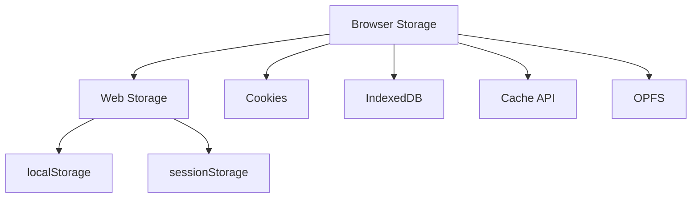

# Хранение данных в браузере

## Общая идея

Браузер предоставляет несколько механизмов хранения данных. Они отличаются объёмом, сроком жизни, форматом данных, производительностью, доступностью из JavaScript и тем, отправляются ли данные на сервер автоматически.

Основные варианты:



Для большинства собеседований обязательно понимать четыре механизма:

- `localStorage`;
- `sessionStorage`;
- cookies;
- IndexedDB.

Cache API и OPFS встречаются реже, но важны для PWA, офлайн-приложений и работы с большими файлами.

---

## Быстрое сравнение

| Хранилище | Формат | API | Срок жизни | Отправляется на сервер | Основное применение |
| --- | --- | --- | --- | --- | --- |
| `localStorage` | Строки | Синхронный | До явного удаления | Нет | Настройки и небольшое состояние |
| `sessionStorage` | Строки | Синхронный | Пока существует вкладка | Нет | Временное состояние конкретной вкладки |
| Cookie | Строка | HTTP и `document.cookie` | Сессия или заданный срок | Да, если запрос подходит по правилам cookie | Серверная сессия, авторизация, небольшие флаги |
| IndexedDB | Структурированные данные | Асинхронный, транзакционный | До удаления или очистки браузером | Нет | Большие наборы данных, офлайн-режим |
| Cache API | Пары Request/Response | Асинхронный | До удаления или очистки браузером | Нет | Кеш HTTP-ресурсов и PWA |
| OPFS | Файлы и каталоги | Асинхронный; отдельные sync API в Worker | До удаления или очистки браузером | Нет | Большие файлы, редакторы, SQLite/WASM |

Точные квоты зависят от браузера, устройства, свободного места, режима просмотра и активности сайта. Нельзя проектировать приложение, предполагая фиксированный одинаковый лимит во всех браузерах.

---

## 1. `localStorage`

`localStorage` — синхронное key-value-хранилище из Web Storage API. Оно привязано к origin страницы.

Origin образуется сочетанием:

```text
scheme + host + port
```

Например, это разные origin:

```text
https://example.com
http://example.com
https://api.example.com
https://example.com:8080
```

### Срок жизни

Данные сохраняются после:

- перезагрузки страницы;
- закрытия вкладки;
- закрытия и повторного открытия браузера.

У `localStorage` нет встроенного срока истечения. Данные исчезают, когда пользователь или приложение очищает их, браузер удаляет данные сайта либо заканчивается приватная сессия.

### Основные методы

```js
localStorage.setItem('theme', 'dark');

const theme = localStorage.getItem('theme');

localStorage.removeItem('theme');

localStorage.clear();

const keysCount = localStorage.length;
const firstKey = localStorage.key(0);
```

`getItem` возвращает строку или `null`, если ключ отсутствует.

### Хранятся только строки

```js
localStorage.setItem('count', 10);

console.log(localStorage.getItem('count')); // '10'
```

Объекты нужно сериализовать:

```js
const settings = {
  theme: 'dark',
  compactMode: true,
};

localStorage.setItem('settings', JSON.stringify(settings));

const rawSettings = localStorage.getItem('settings');

const parsedSettings = rawSettings
  ? JSON.parse(rawSettings)
  : null;
```

У `JSON.stringify` есть ограничения: теряются методы, `undefined`, символы и часть специальных типов. `BigInt` без дополнительного преобразования сериализовать нельзя, а `Date` превращается в строку.

### Собственный TTL

Так как встроенного времени жизни нет, его можно реализовать вручную:

```js
function setWithTTL(key, value, ttlMs) {
  localStorage.setItem(
    key,
    JSON.stringify({
      value,
      expiresAt: Date.now() + ttlMs,
    }),
  );
}

function getWithTTL(key) {
  const rawValue = localStorage.getItem(key);

  if (!rawValue) {
    return null;
  }

  const item = JSON.parse(rawValue);

  if (Date.now() >= item.expiresAt) {
    localStorage.removeItem(key);
    return null;
  }

  return item.value;
}
```

Это «ленивое» удаление: просроченная запись удалится при следующем чтении. При необходимости добавляют периодическую очистку.

### Событие `storage`

Изменения `localStorage` можно отслеживать в других документах того же origin:

```js
window.addEventListener('storage', (event) => {
  console.log(event.key);
  console.log(event.oldValue);
  console.log(event.newValue);
});
```

Важная особенность: событие не вызывается в окне, которое само внесло изменение. Для `localStorage` оно приходит в другие вкладки и окна того же origin.

Для более явной коммуникации между вкладками часто используют `BroadcastChannel`, а хранилище оставляют только источником состояния.

### Преимущества

- очень простой API;
- данные переживают перезапуск браузера;
- удобно хранить тему, язык и небольшие пользовательские настройки;
- доступно в других вкладках того же origin.

### Недостатки

- синхронный API блокирует основной поток;
- хранит только строки;
- не предоставляет транзакции и индексы;
- не имеет встроенного TTL;
- не подходит для больших объёмов;
- любое JavaScript-выполнение в origin может прочитать данные;
- при превышении квоты операция записи может выбросить исключение.

### Когда использовать

Подходящие примеры:

- выбранная тема;
- язык интерфейса;
- состояние небольшого фильтра;
- скрытые пользователем подсказки;
- небольшая черновая настройка.

Не следует хранить:

- большие списки и бинарные файлы;
- данные, требующие сложного поиска;
- критически важные данные без серверной копии;
- секреты и чувствительные токены, доступные JavaScript.

---

## 2. `sessionStorage`

`sessionStorage` использует тот же интерфейс `Storage` и те же методы, что и `localStorage`:

```js
sessionStorage.setItem('checkoutStep', 'payment');

const step = sessionStorage.getItem('checkoutStep');

sessionStorage.removeItem('checkoutStep');
```

### Главное отличие от `localStorage`

`sessionStorage` привязан не только к origin, но и к конкретному top-level browsing context — обычно к вкладке.

Данные:

- переживают перезагрузку страницы в этой вкладке;
- не разделяются как общее состояние между обычными независимыми вкладками;
- очищаются после завершения сессии вкладки, обычно при её закрытии.

### Подходящие сценарии

- текущий шаг многостраничной формы;
- временный черновик во вкладке;
- состояние возврата на страницу;
- данные, которые не должны сохраняться между сессиями браузера;
- временный идентификатор пользовательского потока.

### Ограничения

Они почти такие же, как у `localStorage`:

- синхронное выполнение;
- только строки;
- отсутствие индексов и транзакций;
- доступность для JavaScript того же origin;
- ограниченная квота.

### Сравнение с обычной переменной

```js
let currentStep = 2;
```

Обычная переменная исчезнет при перезагрузке страницы. Значение в `sessionStorage` сохранится при перезагрузке, но обычно исчезнет после закрытия вкладки.

---

## 3. Cookies

Cookie — небольшой фрагмент данных, связанный с сайтом. Главное отличие от остальных хранилищ: подходящие cookies автоматически добавляются браузером к HTTP-запросам.

```http
Cookie: sessionId=abc123
```

Сервер устанавливает cookie заголовком:

```http
Set-Cookie: sessionId=abc123; Path=/; Secure; HttpOnly; SameSite=Lax
```

JavaScript может установить доступную ему cookie через `document.cookie`:

```js
document.cookie = 'theme=dark; Path=/; Max-Age=2592000; SameSite=Lax';
```

Запись в `document.cookie` добавляет или обновляет одну cookie, а не заменяет все cookies целиком.

### Session и persistent cookies

**Session cookie** не содержит `Expires` или `Max-Age` и хранится в рамках браузерной сессии. Современные браузеры могут восстанавливать сессии, поэтому нельзя использовать закрытие окна как строгую гарантию немедленного удаления.

**Persistent cookie** имеет срок жизни:

```http
Set-Cookie: theme=dark; Max-Age=2592000
```

`Max-Age` задаётся в секундах. Также существует `Expires` с абсолютной датой.

### Основные атрибуты

#### `HttpOnly`

```http
Set-Cookie: sessionId=abc123; HttpOnly
```

Запрещает доступ к значению через `document.cookie`. Cookie продолжает отправляться в подходящих HTTP-запросах.

Используется для серверных сессий и снижает риск кражи cookie при XSS. При этом XSS всё ещё может выполнять действия от имени пользователя, поэтому `HttpOnly` не заменяет защиту от XSS.

#### `Secure`

```http
Set-Cookie: sessionId=abc123; Secure
```

Разрешает отправку cookie только по защищённому HTTPS-соединению, кроме отдельных специальных условий разработки вроде localhost.

#### `SameSite`

Контролирует отправку cookie в cross-site-контексте и помогает защищаться от CSRF.

- `Strict` — наиболее строгое ограничение cross-site-отправки;
- `Lax` — допускает часть безопасных top-level-переходов;
- `None` — разрешает cross-site-отправку и требует `Secure`.

Лучше указывать `SameSite` явно, а не полагаться на значение браузера по умолчанию.

#### `Domain`

Определяет хосты, которым может отправляться cookie. Если `Domain` не задан, cookie является host-only. Если разрешён домен, cookie может быть доступна его поддоменам в рамках правил браузера.

#### `Path`

Ограничивает URL-пути, при запросах к которым cookie отправляется:

```http
Set-Cookie: adminToken=value; Path=/admin
```

`Path` управляет отправкой, но не должен рассматриваться как надёжная граница безопасности между частями одного сайта.

#### Префикс `__Host-`

Для cookie с префиксом `__Host-` требуются `Secure`, `Path=/` и отсутствие `Domain`. Это делает область cookie жёстко привязанной к установившему её хосту.

```http
Set-Cookie: __Host-session=abc123; Path=/; Secure; HttpOnly; SameSite=Lax
```

### Cookies и авторизация

Для серверной веб-сессии часто выбирают cookie с настройками:

```http
Set-Cookie: __Host-session=opaque-session-id; Path=/; Secure; HttpOnly; SameSite=Lax
```

Преимущества такого подхода:

- JavaScript не может прочитать `HttpOnly`-значение;
- браузер автоматически прикрепляет cookie;
- сервер может централизованно отозвать сессию.

Но нужно учитывать CSRF, CORS, `SameSite`, срок жизни, ротацию сессий и защиту от XSS.

### Недостатки cookies

- небольшой допустимый размер одной записи;
- cookies увеличивают размер подходящих HTTP-запросов;
- неудобный строковый API;
- ограничения third-party cookies и partitioning;
- неверные атрибуты создают риски XSS, CSRF и перехвата;
- cookies не предназначены для больших клиентских данных.

### Когда использовать

- идентификатор серверной сессии;
- небольшой серверный флаг;
- данные, которые сервер должен получать вместе с запросом;
- предпочтения, которые нужны серверу до выполнения клиентского JavaScript.

---

## 4. IndexedDB

IndexedDB — асинхронная транзакционная объектная база данных внутри браузера. Она предназначена для существенно более сложных и объёмных данных, чем Web Storage.

### Основные понятия

- **Database** — база данных с именем и версией.
- **Object store** — хранилище записей, похожее по назначению на таблицу, но без фиксированных колонок.
- **Key** — первичный ключ записи.
- **Index** — дополнительный путь поиска по полю записи.
- **Transaction** — атомарная группа операций с одним или несколькими object stores.
- **Cursor** — последовательный обход записей или диапазона.

IndexedDB хранит значения через алгоритм structured clone. Можно сохранять объекты, массивы, даты, `Blob`, `ArrayBuffer` и многие другие типы без ручного `JSON.stringify`.

Функции и DOM-узлы хранить как обычные клонируемые значения нельзя.

### Открытие и миграция базы

```js
const openRequest = indexedDB.open('shop', 1);

openRequest.onupgradeneeded = () => {
  const db = openRequest.result;

  const products = db.createObjectStore('products', {
    keyPath: 'id',
  });

  products.createIndex('by-category', 'category');
};

openRequest.onsuccess = () => {
  const db = openRequest.result;
  console.log('Database opened', db);
};

openRequest.onerror = () => {
  console.error(openRequest.error);
};
```

Изменение структуры выполняют в `onupgradeneeded`, увеличивая версию базы.

### Добавление записи

```js
function addProduct(db, product) {
  return new Promise((resolve, reject) => {
    const transaction = db.transaction('products', 'readwrite');
    const store = transaction.objectStore('products');

    store.put(product);

    transaction.oncomplete = () => resolve();
    transaction.onerror = () => reject(transaction.error);
    transaction.onabort = () => reject(transaction.error);
  });
}
```

```js
await addProduct(db, {
  id: 1,
  name: 'Keyboard',
  category: 'electronics',
  price: 100,
});
```

### Чтение по ключу

```js
function getProduct(db, id) {
  return new Promise((resolve, reject) => {
    const transaction = db.transaction('products', 'readonly');
    const store = transaction.objectStore('products');
    const request = store.get(id);

    request.onsuccess = () => resolve(request.result);
    request.onerror = () => reject(request.error);
  });
}
```

### Поиск через индекс

```js
const transaction = db.transaction('products', 'readonly');
const store = transaction.objectStore('products');
const categoryIndex = store.index('by-category');
const request = categoryIndex.getAll('electronics');

request.onsuccess = () => {
  console.log(request.result);
};
```

### Транзакции

```js
const transaction = db.transaction(
  ['products', 'orders'],
  'readwrite',
);
```

Если операция внутри транзакции завершается ошибкой и транзакция прерывается, её изменения откатываются. Это позволяет сохранять согласованность данных.

Транзакции IndexedDB имеют ограниченное время жизни. Нельзя бездумно вставлять произвольный длительный `await` между операциями одной транзакции: транзакция может стать неактивной, когда Event Loop вернёт управление браузеру.

### Почему часто используют библиотеку

Нативный API IndexedDB основан на событиях и довольно многословен. На практике используют обёртки, например:

- `idb` — небольшой Promise-интерфейс;
- Dexie — более высокоуровневая библиотека с удобными запросами и схемами.

На собеседовании важно понимать саму IndexedDB, даже если в проекте использовалась библиотека.

### Преимущества

- асинхронный API;
- хранение структурированных и бинарных данных;
- транзакции;
- первичные ключи и индексы;
- поиск и обход через cursor;
- подходит для больших наборов данных;
- доступна в Web Workers.

### Недостатки

- сложный нативный API;
- нужно продумывать версионирование и миграции;
- квоты и поведение очистки зависят от браузера;
- IndexedDB не заменяет серверную базу данных и резервное копирование;
- несколько вкладок могут усложнить обновление версии базы.

### Когда использовать

- офлайн-first приложение;
- локальный кеш API-данных;
- каталог товаров или сообщений;
- черновики большого документа;
- очередь операций для последующей синхронизации;
- изображения, `Blob` и другие объёмные данные;
- клиентская база с индексированным поиском.

---

## 5. Cache API

Cache API хранит пары HTTP `Request` и `Response`. Он особенно часто используется Service Worker для офлайн-режима и управления загрузкой ресурсов.

```js
const cache = await caches.open('app-v1');

await cache.addAll([
  '/',
  '/styles.css',
  '/app.js',
]);

const cachedResponse = await cache.match('/styles.css');
```

Запись ответа API:

```js
const response = await fetch('/api/products');
const cache = await caches.open('api-v1');

await cache.put('/api/products', response.clone());
```

`Response` часто нужно клонировать, потому что его body является потоком и обычно читается один раз.

### Подходит для

- статических ресурсов PWA;
- офлайн-страниц;
- кеширования HTTP-ответов;
- стратегий cache-first, network-first и stale-while-revalidate.

### Не подходит для

- сложных выборок по полям объекта;
- транзакционных бизнес-данных;
- замены IndexedDB.

Приложение должно самостоятельно реализовать версионирование, инвалидацию и удаление старых кешей.

---

## 6. Origin Private File System

**OPFS** — приватная для origin файловая система. Она входит в File System API и позволяет работать с каталогами и файлами, не показывая их как обычные пользовательские файлы.

```js
const root = await navigator.storage.getDirectory();
const fileHandle = await root.getFileHandle('draft.txt', {
  create: true,
});

const writable = await fileHandle.createWritable();
await writable.write('Draft content');
await writable.close();
```

OPFS подходит для:

- больших локальных файлов;
- фото- и видеоредакторов;
- CAD и графических приложений;
- виртуальной файловой системы;
- баз данных на WebAssembly, например SQLite;
- частых изменений содержимого файла.

Файлы OPFS:

- принадлежат origin;
- не обязаны соответствовать обычным файлам, видимым пользователю;
- учитываются в квоте хранилища;
- удаляются при очистке данных сайта;
- не являются заменой пользовательскому экспорту и резервной копии.

---

## 7. Квоты, очистка и постоянство

Клиентское хранилище нельзя считать абсолютно постоянным. Данные могут исчезнуть, если:

- пользователь очистил данные сайта;
- приложение вызвало удаление;
- браузер очищает best-effort storage при нехватке места;
- пользователь работает в приватном режиме;
- изменились браузерные политики хранения;
- приложение удалено или origin больше не используется.

### Проверка использования и квоты

```js
const estimate = await navigator.storage.estimate();

console.log(estimate.usage);
console.log(estimate.quota);
```

Результат является оценкой, а не обещанием, что всё оставшееся пространство можно занять.

### Запрос persistent storage

```js
const persisted = await navigator.storage.persist();
```

Браузер самостоятельно решает, удовлетворить ли запрос. Persistent storage лучше защищён от автоматического удаления при нехватке места, но пользователь всё равно может очистить данные сайта.

### Обработка превышения квоты

```js
try {
  localStorage.setItem('data', largeValue);
} catch (error) {
  if (error instanceof DOMException) {
    console.error('Browser storage write failed', error);
  }
}
```

Для IndexedDB, Cache API и OPFS превышение доступной квоты может приводить к `QuotaExceededError`. Запись нужно обрабатывать как потенциально ошибочную и предусматривать удаление устаревших данных.

---

## 8. Безопасность

### XSS

Если злоумышленник может выполнить JavaScript в origin, он обычно может прочитать `localStorage`, `sessionStorage` и доступные JavaScript cookies, а также обратиться к IndexedDB.

Поэтому нельзя считать клиентское хранилище защищённым сейфом.

Основные меры:

- экранирование и безопасный вывод данных;
- Content Security Policy;
- отказ от опасного `innerHTML` с непроверенными данными;
- проверка и очистка пользовательского HTML;
- обновление зависимостей;
- `HttpOnly` для cookies, которые не нужны JavaScript.

### XSS и CSRF — разные угрозы

- **XSS** позволяет внедрить JavaScript в доверенный origin.
- **CSRF** заставляет браузер отправить авторизованный запрос с другого сайта.

`HttpOnly` помогает защитить значение cookie от чтения через JavaScript, но не блокирует все действия XSS.

`SameSite` и CSRF-токены помогают защищаться от CSRF, но не устраняют XSS.

### Не хранить секреты во frontend

Секретные API-ключи, приватные ключи и серверные credentials нельзя безопасно спрятать в браузере. Пользователь контролирует клиентское окружение и может прочитать код и запросы приложения.

### Шифрование на клиенте

Шифрование данных в `localStorage` не решает проблему, если ключ доступен тому же JavaScript: XSS сможет получить и данные, и ключ. Шифрование полезно только при корректной модели угроз и независимом безопасном управлении ключами.

---

## 9. Как выбрать хранилище

### Небольшая настройка должна сохраняться после закрытия браузера

Используйте `localStorage`.

```js
localStorage.setItem('theme', 'dark');
```

### Временные данные нужны только одной вкладке

Используйте `sessionStorage`.

```js
sessionStorage.setItem('formStep', '2');
```

### Сервер должен автоматически получать идентификатор сессии

Используйте безопасно настроенную cookie, обычно `Secure`, `HttpOnly` и подходящий `SameSite`.

### Нужны большие структурированные данные, индексы и транзакции

Используйте IndexedDB.

### Нужно кешировать HTTP-запросы и ответы для PWA

Используйте Cache API.

### Нужно интенсивно работать с большими файлами

Рассмотрите OPFS.

### Данные критически важны и должны быть доступны на разных устройствах

Основной источник истины должен находиться на сервере. Браузерное хранилище можно использовать как кеш, офлайн-копию или очередь синхронизации.

---

## 10. Частые ошибки

### Хранение объекта без сериализации

```js
localStorage.setItem('user', { id: 1 });

console.log(localStorage.getItem('user'));
// '[object Object]'
```

Нужно использовать `JSON.stringify` и `JSON.parse`.

### Небезопасный `JSON.parse`

Данные могли быть повреждены или иметь старую схему:

```js
function readJSON(key) {
  const rawValue = localStorage.getItem(key);

  if (!rawValue) {
    return null;
  }

  try {
    return JSON.parse(rawValue);
  } catch {
    localStorage.removeItem(key);
    return null;
  }
}
```

После парсинга также полезно валидировать структуру.

### Использование `localStorage` для больших данных

API синхронный и способен блокировать главный поток. Для больших наборов лучше IndexedDB.

### Хранение авторизационного токена без анализа угроз

Токен в `localStorage` доступен JavaScript и может быть украден при XSS. Для серверной сессии часто безопаснее `HttpOnly` cookie с корректной защитой от CSRF.

Выбор зависит от архитектуры: нельзя механически заявлять, что любой вариант безопасен без учёта XSS, CSRF, доменов, CORS и способа отзыва токена.

### Отсутствие очистки и миграции

Формат хранимых данных меняется между версиями приложения. Нужно версионировать ключи, валидировать схему и удалять устаревшие записи.

```js
const STORAGE_VERSION = 2;
const STORAGE_KEY = `settings:v${STORAGE_VERSION}`;
```

### Использование `clear()` библиотечным кодом

```js
localStorage.clear();
```

Метод удаляет все записи origin, включая данные других частей приложения. Безопаснее удалять только собственные ключи.

### Предположение о вечном хранении

Пользователь и браузер могут очистить клиентские данные. Критические данные должны синхронизироваться с сервером.

### Отсутствие обработки ошибок записи

Запись может завершиться ошибкой из-за квоты, режима приватного просмотра, пользовательских настроек или ограничений окружения.

---

## 11. Вопросы и ответы для собеседования

### Чем `localStorage` отличается от `sessionStorage`?

Оба механизма синхронные и хранят строки. `localStorage` разделяется документами одного origin и сохраняется после закрытия браузера, а `sessionStorage` дополнительно привязан к вкладке и существует в рамках её page session.

### Что быстрее и проще для небольшой настройки?

Обычно `localStorage`, но его синхронность означает, что его нельзя использовать для больших объёмов или частых тяжёлых операций.

### Можно ли хранить объект в `localStorage`?

Только после преобразования в строку, обычно через `JSON.stringify`. При чтении используют `JSON.parse` и проверяют схему данных.

### Почему `localStorage` может ухудшить производительность?

Его методы синхронные и блокируют выполнение JavaScript на время доступа к хранилищу.

### Что происходит при изменении `localStorage` в другой вкладке?

Другие документы того же origin получают событие `storage`. Окно, внесшее изменение, это событие не получает.

### Главное отличие cookie от Web Storage?

Подходящие cookies автоматически отправляются серверу с HTTP-запросами. `localStorage` и `sessionStorage` доступны только клиентскому коду и сами на сервер не отправляются.

### Что делает `HttpOnly`?

Запрещает чтение cookie через JavaScript, но не мешает браузеру отправлять её в подходящих запросах.

### Что делает `SameSite`?

Ограничивает отправку cookie в cross-site-контексте и помогает снижать риск CSRF.

### Что делает `Secure`?

Разрешает передачу cookie только через защищённое HTTPS-соединение с предусмотренными браузером исключениями для разработки.

### Почему cookie не подходит для больших данных?

Размер cookie ограничен, а её значение добавляет трафик ко всем подходящим запросам.

### Когда нужен IndexedDB?

Когда требуется хранить большие структурированные данные, выполнять поиск по ключам и индексам, использовать транзакции или поддерживать офлайн-режим.

### IndexedDB — это SQL-база?

Нет. Это объектная транзакционная база с object stores, ключами и индексами. Запросы строятся через API IndexedDB, а не SQL.

### Почему IndexedDB лучше `localStorage` для больших данных?

IndexedDB асинхронна, поддерживает structured clone, индексы и транзакции. `localStorage` синхронен и хранит только строки.

### Cache API и HTTP cache — одно и то же?

Нет. Обычным HTTP cache управляют браузер и HTTP-заголовки. Cache API позволяет приложению явно сохранять и получать пары Request/Response, часто через Service Worker.

### Можно ли считать браузерное хранилище постоянным?

Нет. Пользователь может очистить данные, а best-effort storage иногда удаляется браузером при нехватке места. Критические данные должны иметь серверную копию.

### Где лучше хранить JWT?

Универсального ответа нет. Токен в Web Storage доступен JavaScript и уязвим для кражи при XSS. `HttpOnly` cookie нельзя прочитать через JavaScript, но нужно учитывать CSRF и правила отправки cookies. Выбор зависит от модели угроз и архитектуры приложения.

---

## Краткий ответ для собеседования

> Для небольших строковых данных браузер предоставляет синхронные `localStorage` и `sessionStorage`: первое сохраняется между сессиями, второе привязано к вкладке. Cookies отличаются тем, что автоматически отправляются серверу и поддерживают атрибуты `HttpOnly`, `Secure` и `SameSite`, поэтому часто используются для серверных сессий. Для больших структурированных данных, индексов и транзакций применяется асинхронная IndexedDB. Для кеширования HTTP Request/Response используется Cache API, а для файловой работы — OPFS. Клиентское хранилище нельзя считать вечным или безопасным местом для секретов.

## Чек-лист подготовки

Перед собеседованием нужно уметь:

- сравнить `localStorage`, `sessionStorage`, cookies и IndexedDB;
- объяснить origin и область видимости данных;
- рассказать о сроке жизни каждого хранилища;
- объяснить синхронность Web Storage;
- сериализовать объект и безопасно его прочитать;
- описать событие `storage`;
- объяснить атрибуты `HttpOnly`, `Secure`, `SameSite`, `Domain` и `Path`;
- сравнить защиту от XSS и CSRF;
- описать object store, key, index и transaction в IndexedDB;
- объяснить назначение Cache API и OPFS;
- рассказать о квотах и возможности очистки данных;
- выбрать подходящее хранилище для конкретной задачи.

## Источники

- [Web Storage API — MDN](https://developer.mozilla.org/en-US/docs/Web/API/Web_Storage_API)
- [`localStorage` — MDN](https://developer.mozilla.org/en-US/docs/Web/API/Window/localStorage)
- [`sessionStorage` — MDN](https://developer.mozilla.org/en-US/docs/Web/API/Window/sessionStorage)
- [Использование HTTP cookies — MDN](https://developer.mozilla.org/en-US/docs/Web/HTTP/Guides/Cookies)
- [IndexedDB API — MDN](https://developer.mozilla.org/en-US/docs/Web/API/IndexedDB_API)
- [Квоты и очистка хранилища — MDN](https://developer.mozilla.org/en-US/docs/Web/API/Storage_API/Storage_quotas_and_eviction_criteria)
- [Origin Private File System — MDN](https://developer.mozilla.org/en-US/docs/Web/API/File_System_API/Origin_private_file_system)
