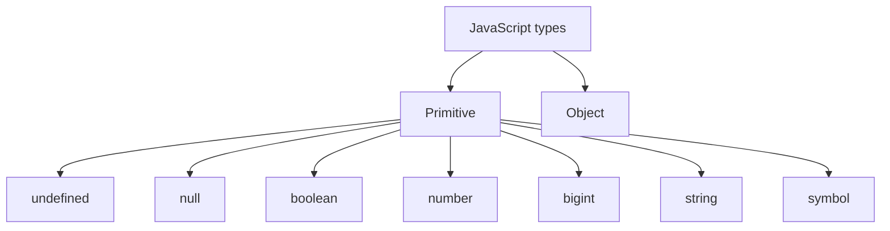

# Типы данных в JavaScript

## Общая модель типов

JavaScript — язык с **динамической типизацией**: тип принадлежит значению, а не переменной. Одна переменная может последовательно хранить значения разных типов.

```js
let value = 10;
value = 'ten';
value = { count: 10 };
```

Динамическая типизация не равна отсутствию типов. Каждое значение JavaScript имеет определённый тип во время выполнения.

Спецификация ECMAScript выделяет восемь основных language types:

- `Undefined`;
- `Null`;
- `Boolean`;
- `Number`;
- `BigInt`;
- `String`;
- `Symbol`;
- `Object`.

Первые семь являются примитивными типами. `Object` — непримитивный тип.



---

## Быстрое сравнение

| Тип | Пример | Основное назначение |
| --- | --- | --- |
| `undefined` | `let value;` | Значение не задано |
| `null` | `const user = null` | Намеренное отсутствие значения |
| `boolean` | `true`, `false` | Логическое состояние |
| `number` | `42`, `3.14`, `NaN` | Числа IEEE 754 double precision |
| `bigint` | `9007199254740993n` | Целые произвольной точности |
| `string` | `'hello'` | Текстовые данные |
| `symbol` | `Symbol('id')` | Уникальные значения и ключи свойств |
| `object` | `{}`, `[]`, `new Date()` | Составные и изменяемые структуры |

Массив, функция, `Date`, `Map`, `Set`, `RegExp`, `Promise` и `Error` относятся к типу Object, но представляют разные разновидности объектов.

---

## 1. `undefined`

`undefined` — примитивный тип с единственным значением `undefined`.

Оно появляется, когда:

- переменная объявлена без значения;
- отсутствующему параметру функции ничего не передали;
- функция завершилась без явного `return`;
- читается отсутствующее свойство объекта;
- выполняется `return;` без значения.

```js
let value;
console.log(value); // undefined

function getValue() {}
console.log(getValue()); // undefined

const user = {};
console.log(user.name); // undefined
```

`undefined` обычно означает, что значение ещё не задано или отсутствует технически.

---

## 2. `null`

`null` — отдельный примитивный тип с единственным значением `null`. Обычно он обозначает намеренное отсутствие объекта или значения.

```js
let selectedUser = null;

if (selectedUser === null) {
  console.log('Пользователь не выбран');
}
```

Классическая особенность:

```js
typeof null; // 'object'
```

Это историческая особенность оператора `typeof`, а не доказательство того, что `null` является объектом. Для проверки используют прямое сравнение:

```js
value === null;
```

### `null` против `undefined`

Универсального бизнес-правила нет, но распространённая договорённость:

- `undefined` — значение не задано;
- `null` — отсутствие задано явно.

При нестрогом сравнении они равны друг другу:

```js
null == undefined;  // true
null === undefined; // false
```

В прикладном коде обычно предпочитают строгое сравнение.

---

## 3. `boolean`

Тип содержит два значения:

```js
true;
false;
```

```js
const isAuthenticated = true;
const hasAccess = false;
```

### Truthy и falsy

В логическом контексте JavaScript преобразует значения к boolean.

Falsy-значения:

```text
false
0
-0
0n
NaN
''
null
undefined
```

Все остальные значения truthy, включая:

```js
Boolean([]);      // true
Boolean({});      // true
Boolean('false'); // true
Boolean('0');     // true
```

Пустой массив и пустой объект являются объектами и поэтому truthy.

---

## 4. `number`

JavaScript `number` основан на 64-битном формате IEEE 754 double precision. Один тип представляет целые и дробные числа.

```js
const integer = 42;
const fraction = 3.14;
const negative = -10;
const exponent = 1e6;
```

К `number` также относятся специальные значения:

```js
NaN;
Infinity;
-Infinity;
-0;
```

### Точность дробей

Некоторые десятичные дроби нельзя точно представить в двоичной системе:

```js
0.1 + 0.2 === 0.3; // false
```

Для сравнения результатов вычислений используют допустимую погрешность:

```js
const result = 0.1 + 0.2;
const expected = 0.3;

Math.abs(result - expected) < Number.EPSILON;
```

Для денег часто применяют целые минимальные единицы или специализированную decimal-библиотеку.

### Безопасные целые

```js
Number.MAX_SAFE_INTEGER; // 9007199254740991
```

За пределами безопасного диапазона соседние целые могут быть представлены одинаково. Для больших целых используют `BigInt` или строку, если значение является идентификатором.

### `NaN`

`NaN` означает недопустимый числовой результат, но относится к типу `number`.

```js
Number('hello'); // NaN
```

`NaN` не равен самому себе:

```js
NaN === NaN; // false
```

Надёжная проверка:

```js
Number.isNaN(value);
```

Глобальная функция `isNaN` сначала выполняет приведение типа, поэтому способна дать неожиданный результат:

```js
isNaN('hello');        // true
Number.isNaN('hello'); // false
```

### Проверки чисел

```js
Number.isNaN(value);
Number.isFinite(value);
Number.isInteger(value);
Number.isSafeInteger(value);
```

---

## 5. `bigint`

`BigInt` хранит целые числа произвольной точности.

```js
const value = 9007199254740993n;
const another = BigInt('9007199254740993');
```

`BigInt` предназначен только для целых:

```js
10n / 3n; // 3n
```

В обычных арифметических операциях `number` и `bigint` нельзя смешивать без явного преобразования:

```js
1n + 1; // TypeError

1n + BigInt(1); // 2n
```

Преобразование большого `BigInt` в `number` может потерять точность.

`JSON.stringify` по умолчанию не умеет сериализовать `BigInt`:

```js
JSON.stringify({ id: 1n }); // TypeError
```

Для передачи используют строку или согласованную схему сериализации.

---

## 6. `string`

Строка — неизменяемая последовательность UTF-16 code units.

```js
const single = 'hello';
const double = "hello";
const template = `Hello, ${name}`;
```

Строки неизменяемы:

```js
let value = 'cat';
value[0] = 'b';

console.log(value); // 'cat'
```

Методы возвращают новую строку:

```js
const upper = value.toUpperCase();
```

Длина в JavaScript измеряется UTF-16 code units, поэтому визуальный символ может занимать больше одной позиции:

```js
'😀'.length; // 2
```

Для перебора Unicode code points можно использовать `for...of` или spread, хотя сложные графемы всё равно могут состоять из нескольких code points.

---

## 7. `symbol`

Каждый вызов `Symbol()` создаёт уникальное примитивное значение:

```js
const first = Symbol('id');
const second = Symbol('id');

first === second; // false
```

Symbol часто используется как ключ свойства, который не конфликтует со строковыми ключами:

```js
const id = Symbol('id');

const user = {
  name: 'Alex',
  [id]: 42,
};
```

Обычные `Object.keys` и `for...in` не возвращают symbol keys. Их можно получить через:

```js
Object.getOwnPropertySymbols(user);
Reflect.ownKeys(user);
```

### Глобальный реестр

```js
const first = Symbol.for('app.id');
const second = Symbol.for('app.id');

first === second; // true
```

`Symbol.for` повторно использует символ из глобального symbol registry текущего агента.

Встроенные well-known symbols, например `Symbol.iterator`, позволяют настраивать поведение объектов в протоколах языка.

---

## 8. `object`

Объект — коллекция свойств и внутреннего поведения. Ключ свойства является строкой или символом, а значение может иметь любой тип.

```js
const user = {
  id: 1,
  name: 'Alex',
};
```

К объектам относятся:

```js
{};
[];
function run() {};
new Date();
/pattern/;
new Map();
new Set();
Promise.resolve();
new Error('failed');
```

### Функция — вызываемый объект

Функция относится к объектам, но имеет внутреннюю возможность вызова.

```js
function greet() {
  return 'hello';
}

greet.language = 'en';
```

### Массив — специальный объект

Массив имеет индексированные свойства и специальное поведение `length`.

```js
const items = ['a', 'b'];

items[0];      // 'a'
items.length;  // 2
```

Для проверки массива используют:

```js
Array.isArray(items);
```

### Объекты сравниваются по identity

```js
{} === {}; // false
[] === []; // false

const first = {};
const second = first;

first === second; // true
```

Два объекта с одинаковыми свойствами остаются разными объектами.

---

## Примитивы и объекты

### Неизменяемость примитивов

Примитивное значение нельзя изменить. Можно только присвоить переменной другое значение.

```js
let name = 'Alex';
name = 'Max';
```

### Изменяемость объектов

Свойства объекта можно менять, даже если переменная объявлена через `const`:

```js
const user = { name: 'Alex' };

user.name = 'Max'; // Разрешено.
// user = {};      // Ошибка: нельзя заменить значение переменной.
```

`const` запрещает повторное присваивание переменной, а не изменение объекта.

### Копирование значений

JavaScript всегда передаёт и присваивает значения. Для объекта таким значением является ссылка на объект.

```js
let firstNumber = 10;
let secondNumber = firstNumber;
secondNumber = 20;

console.log(firstNumber); // 10
```

```js
const firstUser = { name: 'Alex' };
const secondUser = firstUser;

secondUser.name = 'Max';

console.log(firstUser.name); // 'Max'
```

Фраза «объекты передаются по ссылке» упрощённая. Точнее: ссылка является значением и копируется по значению.

### Поверхностная копия

```js
const original = {
  profile: { name: 'Alex' },
};

const copy = { ...original };

copy.profile.name = 'Max';

console.log(original.profile.name); // 'Max'
```

Spread копирует только первый уровень. Для поддерживаемых значений глубокую копию можно сделать через `structuredClone`:

```js
const copy = structuredClone(original);
```

---

## Primitive wrappers и autoboxing

Для примитивов существуют объекты-обёртки:

```js
new String('hello');
new Number(42);
new Boolean(false);
```

Обычно их не нужно создавать через `new`:

```js
const value = new Boolean(false);

if (value) {
  console.log('Выполнится, потому что объект truthy');
}
```

При обращении к методу примитива JavaScript временно предоставляет поведение соответствующего prototype:

```js
'hello'.toUpperCase(); // 'HELLO'
```

Это не превращает сохранённое значение в постоянный объект.

---

## Неявное приведение типов

JavaScript способен автоматически преобразовывать значения.

```js
'5' + 1; // '51'
'5' - 1; // 4
```

Оператор `+` выполняет конкатенацию, если после преобразования один из операндов является строкой. Другие арифметические операторы обычно приводят операнды к числам.

Нестрогое равенство выполняет приведение:

```js
0 == false;  // true
'' == false; // true
```

Строгое равенство не выполняет такое приведение:

```js
0 === false; // false
```

В прикладном коде обычно используют `===` и явные преобразования:

```js
Number(value);
String(value);
Boolean(value);
```

---

# Как определить тип без `typeof`

Универсального идеального способа для всех задач нет. Выбор проверки зависит от того, нужно ли различить примитивы, встроенные объекты, экземпляры класса или структуру бизнес-данных.

## 1. `Object.prototype.toString.call`

Удобный общий способ получить встроенный строковый tag:

```js
function getType(value) {
  return Object.prototype
    .toString
    .call(value)
    .slice(8, -1)
    .toLowerCase();
}
```

```js
getType(undefined);        // 'undefined'
getType(null);             // 'null'
getType(true);             // 'boolean'
getType(42);               // 'number'
getType(42n);              // 'bigint'
getType('hello');          // 'string'
getType(Symbol('id'));     // 'symbol'
getType({});               // 'object'
getType([]);               // 'array'
getType(() => {});         // 'function'
getType(new Date());       // 'date'
getType(/test/);           // 'regexp'
getType(new Map());        // 'map'
getType(new Set());        // 'set'
getType(Promise.resolve()); // 'promise'
getType(new Error());      // 'error'
```

Почему вызывается именно так:

```js
Object.prototype.toString.call(value);
```

Объект может иметь собственный метод `toString`, переопределённый или вообще отсутствующий. Вызов базового метода через `call` не зависит от `value.toString`.

### Ограничения

Метод показывает встроенный tag, но не всегда различает примитив и wrapper object:

```js
getType('hello');               // 'string'
getType(new String('hello'));   // 'string'
```

Результат также может быть изменён объектом через `Symbol.toStringTag`:

```js
const fake = {
  [Symbol.toStringTag]: 'Array',
};

Object.prototype.toString.call(fake); // '[object Array]'
Array.isArray(fake);                   // false
```

Поэтому для security-sensitive проверки встроенного типа лучше использовать специальный brand-check API, когда он существует.

---

## 2. Специализированные проверки

Для ожидаемого типа специальный метод обычно понятнее универсального `getType`.

### Массив

```js
Array.isArray(value);
```

`Array.isArray` работает и для массивов из другого realm, например iframe, где `value instanceof Array` может вернуть `false` из-за другого конструктора.

### `null`

```js
value === null;
```

### `NaN`

```js
Number.isNaN(value);
```

### Конечное число

```js
Number.isFinite(value);
```

Метод одновременно проверяет, что значение является `number` и не равно `NaN`, `Infinity` или `-Infinity`.

### Целое число

```js
Number.isInteger(value);
```

### Безопасное целое

```js
Number.isSafeInteger(value);
```

---

## 3. `instanceof`

Оператор проверяет, присутствует ли `Constructor.prototype` в prototype chain объекта.

```js
value instanceof Date;
value instanceof Error;
value instanceof Map;
value instanceof User;
```

```js
class User {}

const user = new User();

user instanceof User;   // true
user instanceof Object; // true
```

### Ограничения `instanceof`

- не предназначен для определения большинства примитивов;
- может дать `false` для объекта из другого realm;
- результат зависит от prototype chain;
- поведение может быть настроено через `Symbol.hasInstance`;
- изменённый prototype способен сломать проверку.

```js
[] instanceof Array; // Обычно true, но cross-realm возможен false.
```

Для массива предпочтительнее `Array.isArray`.

---

## 4. Проверка `constructor`

```js
value?.constructor === Date;
value?.constructor === Map;
```

Такой способ встречается, но менее надёжен:

- свойство `constructor` можно изменить;
- объект может иметь `null` prototype;
- конструкторы из разных realms имеют разную identity;
- объект может подделать собственное свойство `constructor`.

```js
const object = Object.create(null);

object.constructor; // undefined
```

`constructor` не стоит использовать как единственную проверку недоверенных данных.

---

## 5. Проверка prototype

```js
Object.getPrototypeOf(value) === Date.prototype;
```

Или проверка присутствия prototype в цепочке:

```js
Date.prototype.isPrototypeOf(value);
```

Такие проверки полезны при работе с собственной prototype-иерархией, но тоже зависят от realm и возможности изменить prototype chain.

Перед `Object.getPrototypeOf` нужно убедиться, что значение допускает объектную операцию, иначе отдельные значения могут привести к ошибке в зависимости от используемой операции.

---

## 6. Примитив или объект без `typeof`

Можно использовать поведение `Object`:

```js
function isPrimitive(value) {
  return value === null || Object(value) !== value;
}
```

Для объекта `Object(value)` возвращает сам объект. Для примитива создаётся или возвращается объектное представление, не равное исходному примитиву.

```js
isPrimitive(10);       // true
isPrimitive('hello');  // true
isPrimitive(null);     // true
isPrimitive({});       // false
isPrimitive([]);       // false
```

Это полезный интервью-приём, но в обычном коде специализированная проверка часто понятнее.

---

## 7. Проверка структуры: duck typing

Для данных API часто важнее не имя класса, а наличие и корректность нужных полей.

```js
function isUser(value) {
  if (getType(value) !== 'object') {
    return false;
  }

  return (
    Object.hasOwn(value, 'id') &&
    Object.hasOwn(value, 'name') &&
    getType(value.id) === 'number' &&
    getType(value.name) === 'string'
  );
}
```

```js
isUser({ id: 1, name: 'Alex' }); // true
isUser({ id: '1' });             // false
```

### `in` против `Object.hasOwn`

```js
'name' in value;
```

`in` проверяет собственные и унаследованные свойства.

```js
Object.hasOwn(value, 'name');
```

`Object.hasOwn` проверяет только собственное свойство.

Наличие свойства не гарантирует правильный тип его значения. Для внешних данных нужна полная проверка схемы. В production часто используют Zod, Valibot, Yup, Joi или JSON Schema.

---

## 8. `Object.is` для особых числовых значений

`Object.is` не определяет общий тип, но помогает различать значения, которые необычно ведут себя с `===`:

```js
Object.is(NaN, NaN); // true

Object.is(0, -0);    // false
0 === -0;            // true
```

Для обычного сравнения объектов `Object.is` по-прежнему проверяет identity:

```js
Object.is({}, {}); // false
```

---

## Сводная таблица способов без `typeof`

| Задача | Рекомендуемый способ | Ограничение |
| --- | --- | --- |
| Получить общий tag | `Object.prototype.toString.call(value)` | `Symbol.toStringTag` может изменить результат |
| Проверить массив | `Array.isArray(value)` | Только массивы |
| Проверить `null` | `value === null` | Только `null` |
| Проверить `NaN` | `Number.isNaN(value)` | Только настоящий `NaN` |
| Проверить экземпляр класса | `value instanceof Class` | Проблемы cross-realm и изменяемый prototype |
| Проверить собственное поле | `Object.hasOwn(value, key)` | Не проверяет тип поля |
| Проверить поле в цепочке | `key in value` | Учитывает унаследованные свойства |
| Проверить бизнес-структуру | Type guard или schema validator | Нужно описать всю ожидаемую схему |
| Отличить примитив от объекта | `value === null || Object(value) !== value` | Менее очевидный приём |

---

## Частые ошибки

### Считать `null` объектом

`null` — примитивный тип. Результат `typeof null === 'object'` является исторической особенностью.

### Проверять массив через `instanceof Array`

В одном realm это часто работает, но надёжнее:

```js
Array.isArray(value);
```

### Использовать `value.constructor.name`

```js
value.constructor.name === 'User';
```

Имя можно изменить при минификации, свойство можно подделать, а cross-realm создаёт другой конструктор.

### Считать `NaN` отдельным типом

`NaN` — специальное числовое значение. Для проверки используется `Number.isNaN`.

### Считать массив отдельным language type

На уровне спецификации массив — специальный Object. Для прикладной проверки у него есть `Array.isArray`.

### Считать функцию примитивом

Функция — callable object.

### Путать проверку формы и происхождения объекта

`instanceof User` проверяет prototype chain. Проверка полей отвечает на другой вопрос: соответствует ли значение ожидаемой структуре.

### Доверять данным после `JSON.parse`

```js
const data = JSON.parse(responseText);
```

Парсинг подтверждает корректность JSON, но не бизнес-тип. Полученный объект нужно валидировать.

---

## Вопросы и ответы для собеседования

### Сколько типов данных в JavaScript?

Спецификация определяет восемь language types: семь примитивных — Undefined, Null, Boolean, Number, BigInt, String и Symbol — и Object.

### Массив — отдельный тип?

Массив является специальным объектом. Для проверки используется `Array.isArray`.

### Функция — объект?

Да. Это объект, который дополнительно можно вызвать.

### Чем примитив отличается от объекта?

Примитивы неизменяемы и сравниваются по значению. Объекты могут иметь изменяемые свойства и сравниваются по identity.

### Почему `NaN !== NaN`?

Так определена семантика IEEE 754 и строгого равенства для `NaN`. Проверять его нужно через `Number.isNaN` или `Object.is(value, NaN)`.

### Чем `null` отличается от `undefined`?

Это два разных примитивных типа. Обычно `undefined` означает незаданное значение, а `null` — явно заданное отсутствие.

### Как определить тип без `typeof`?

Для общего встроенного tag можно использовать `Object.prototype.toString.call(value)`. Для конкретного типа предпочтительнее специальные проверки: `Array.isArray`, `Number.isNaN`, прямое сравнение с `null`, `instanceof` для класса или проверка структуры объекта.

### Почему `instanceof` может не сработать для массива?

Объект из другого realm имеет другой конструктор `Array`, поэтому prototype identity не совпадает. `Array.isArray` выполняет более надёжную проверку массива.

### Можно ли определить бизнес-тип через класс?

Только если данные действительно созданы с нужной prototype chain. Обычный JSON после `JSON.parse` не становится экземпляром класса; его структуру нужно валидировать или преобразовать.

---

## Краткий ответ для собеседования

> В JavaScript семь примитивных типов: `undefined`, `null`, `boolean`, `number`, `bigint`, `string`, `symbol`, а восьмой тип — `object`. Массивы и функции относятся к объектам, причём функция является вызываемым объектом. Без `typeof` общий вид значения можно определить через `Object.prototype.toString.call(value)`, а для конкретных случаев лучше использовать `Array.isArray`, `Number.isNaN`, сравнение с `null`, `instanceof` или проверку структуры данных. У каждого способа есть ограничения: `instanceof` зависит от realm и prototype chain, `constructor` можно подделать, а `toString` может быть изменён через `Symbol.toStringTag`.

## Чек-лист подготовки

Нужно уметь:

- назвать восемь language types;
- перечислить семь примитивов;
- объяснить `null` и `undefined`;
- рассказать про IEEE 754, `NaN` и safe integers;
- объяснить назначение `BigInt` и `Symbol`;
- доказать, что массив и функция являются объектами;
- объяснить сравнение объектов по identity;
- различать shallow и deep copy;
- объяснить truthy и falsy;
- показать определение типа через `Object.prototype.toString.call`;
- сравнить `Array.isArray`, `instanceof`, `constructor` и проверку структуры;
- назвать cross-realm-проблему `instanceof`;
- объяснить `Object.hasOwn` и оператор `in`;
- валидировать данные, полученные из API.

## Источники

- [ECMAScript Language Types — TC39](https://tc39.es/ecma262/multipage/ecmascript-data-types-and-values.html)
- [Grammar and types — MDN](https://developer.mozilla.org/en-US/docs/Web/JavaScript/Guide/Grammar_and_types)
- [`Array.isArray()` — MDN](https://developer.mozilla.org/en-US/docs/Web/JavaScript/Reference/Global_Objects/Array/isArray)
- [Prototype chain — MDN](https://developer.mozilla.org/en-US/docs/Web/JavaScript/Guide/Inheritance_and_the_prototype_chain)
