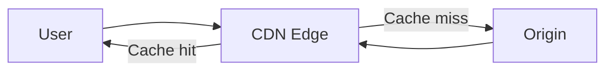

# CDN

## Что такое CDN

**CDN (Content Delivery Network)** — распределённая сеть edge-серверов, которая обслуживает пользователей из близких или оптимальных точек присутствия и снижает нагрузку на origin.



## Основные компоненты

- **origin** — исходный сервер или storage;
- **PoP** — точка присутствия CDN;
- **edge server** — сервер в PoP;
- **cache key** — ключ, по которому ищется объект;
- **TTL** — время свежести;
- **purge/invalidation** — удаление или пометка кеша устаревшим.

## Как проходит запрос

1. DNS или Anycast направляет пользователя к CDN.
2. Edge вычисляет cache key.
3. При cache hit возвращает сохранённый ответ.
4. При cache miss обращается к origin.
5. Если ответ допускает кеширование, сохраняет его.
6. Возвращает ответ пользователю.

Иногда применяются regional cache и origin shield, чтобы несколько edge не создавали одновременную нагрузку на origin.

## Что кеширует CDN

Часто кешируют:

- JS, CSS и шрифты;
- изображения и видео;
- публичные HTML-страницы;
- публичные API-ответы;
- загрузки и обновления приложений.

Персонализированные ответы требуют осторожности. Нельзя случайно закешировать приватный ответ и отдать его другому пользователю.

## Cache key

Обычно включает hostname и URL path. В зависимости от конфигурации может учитывать:

- query-параметры;
- HTTP-метод;
- selected headers;
- cookies;
- параметры преобразования изображения.

Слишком широкий ключ снижает cache hit ratio. Слишком узкий может смешать разные представления и создать утечку.

## Управление через HTTP

CDN может учитывать:

```http
Cache-Control: public, max-age=60, s-maxage=3600
```

- `max-age` относится к свежести в кешах;
- `s-maxage` переопределяет её для shared caches;
- `private` запрещает хранение shared cache;
- `no-store` запрещает хранение;
- `Vary` добавляет request headers в выбор представления.

У конкретного CDN правила конфигурации могут переопределять origin headers.

## Invalidation

Основные стратегии:

- короткий TTL;
- purge конкретного URL;
- purge по тегу;
- versioned URL;
- immutable asset с content hash.

Для статических assets удобен content hash:

```text
/assets/app.4f3a91c2.js
```

Новая версия получает новый URL, поэтому старый объект можно кешировать долго.

## Преимущества

- меньшая latency;
- разгрузка origin;
- высокая пропускная способность;
- устойчивость к всплескам;
- защита от части DDoS-атак;
- TLS termination;
- WAF и rate limiting;
- сжатие и image optimization.

CDN не заменяет безопасный и масштабируемый origin. При cache miss запросы всё равно доходят до него.

## Динамический контент

Даже без кеширования body CDN может ускорять запросы через:

- близкий TLS endpoint;
- повторное соединение с origin;
- оптимизированный backbone;
- connection pooling;
- smart routing;
- edge compute.

## Риски

### Устаревший контент

Слишком большой TTL или неудачный purge оставляет старую версию.

### Cache stampede

После истечения популярного объекта много edge-запросов одновременно идут на origin. Используют request collapsing, stale-while-revalidate, jitter и origin shield.

### Cache poisoning

Атакующий заставляет кеш сохранить вредоносный вариант ответа. Нужно корректно формировать cache key, валидировать headers и не включать неконтролируемые данные в кешируемый ответ.

### Персональные данные

Ответ с профилем пользователя не должен становиться общедоступным shared cache. Применяют `private`, `no-store`, правильную авторизацию и явные CDN rules.

## CDN и DNS

DNS часто указывает hostname на CDN через `CNAME` или адреса edge. Anycast позволяет нескольким PoP объявлять один IP, а маршрутизация сети направляет клиента к подходящей точке.

DNS выбирает адрес, но не передаёт содержимое HTTP-ответа. Кеширование контента выполняет CDN edge.

## Типичные вопросы

### CDN работает только со статикой?

Нет. Он может кешировать публичные динамические ответы, выполнять edge code и проксировать некешируемые запросы.

### Что такое cache hit и miss?

Hit — подходящий свежий объект найден на edge. Miss — edge обращается к следующему уровню или origin.

### Как обновить закешированный JS?

Использовать filename с content hash и ссылаться на новый URL из HTML.

### Где завершается TLS?

Часто на CDN edge. Между CDN и origin желательно отдельное проверяемое TLS-соединение.

## Краткий ответ

> CDN — глобальная сеть edge-серверов перед origin. Она направляет пользователя к близкой точке, возвращает кеш при hit и запрашивает origin при miss. CDN уменьшает latency и нагрузку, помогает с TLS, DDoS и оптимизацией контента. Ключевые задачи — правильный cache key, TTL, invalidation и защита приватных ответов.

## Источники

- [Cloudflare: What is a CDN?](https://www.cloudflare.com/learning/cdn/what-is-a-cdn/)
- [RFC 9111: HTTP Caching](https://www.rfc-editor.org/rfc/rfc9111.html)

