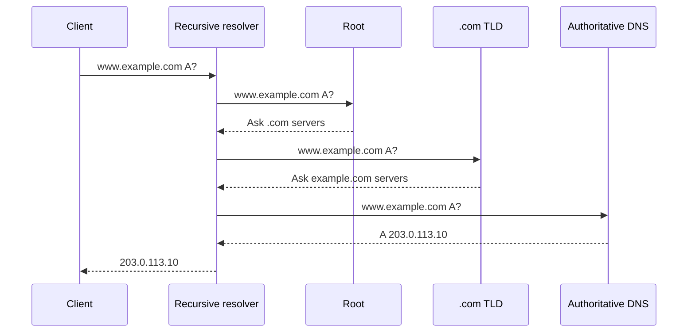

# DNS

## Что такое DNS

**DNS (Domain Name System)** — распределённая иерархическая система имён. Она позволяет получить записи, связанные с доменным именем, например IP-адрес сервера.

DNS не «соединяет браузер с сайтом». Он предоставляет данные для следующего этапа сетевого взаимодействия.

## Участники

- **stub resolver** — компонент на устройстве пользователя;
- **recursive resolver** — ищет ответ от имени клиента и кеширует его;
- **root nameserver** — указывает на серверы TLD;
- **TLD nameserver** — указывает на authoritative servers зоны;
- **authoritative nameserver** — источник записей конкретной DNS-zone.

## Как разрешается имя

Упрощённый lookup для `www.example.com` без кеша:



На практике ответ может быть найден в кеше браузера, ОС, local resolver или recursive resolver.

## Recursive и iterative queries

При recursive query клиент просит resolver вернуть окончательный ответ или ошибку.

При iterative resolution сервер может вернуть referral — указание, к каким nameservers обратиться дальше. Recursive resolver следует цепочке referral.

## Основные типы записей

| Тип | Назначение |
| --- | --- |
| `A` | IPv4-адрес |
| `AAAA` | IPv6-адрес |
| `CNAME` | Alias на другое имя |
| `MX` | Почтовые серверы домена |
| `NS` | Authoritative nameservers зоны |
| `TXT` | Текстовые данные, в том числе SPF и проверки владения |
| `SRV` | Host и port сервиса |
| `CAA` | Какие CA могут выпускать сертификаты |
| `PTR` | Reverse lookup адреса |
| `SOA` | Основные параметры DNS-zone |

## `CNAME`

```dns
www.example.com. 300 IN CNAME edge.cdn.example.net.
```

Resolver продолжает lookup для целевого имени. `CNAME` обычно не должен сосуществовать с другими типами данных для того же имени.

На apex зоны классический `CNAME` конфликтует с обязательными `SOA` и `NS`, поэтому DNS-провайдеры предлагают `ALIAS`, `ANAME` или CNAME flattening как нестандартные удобства.

## TTL и кеширование

```dns
example.com. 300 IN A 203.0.113.10
```

`300` — TTL в секундах. Кеширующий resolver может использовать запись до истечения TTL.

Изменение DNS не распространяется мгновенно: старые ответы могут оставаться в кешах до завершения их TTL. Фраза «DNS propagation занимает ровно 24–48 часов» неверна — время зависит от TTL, кешей, delegation и поведения resolver.

Перед миграцией TTL часто заранее уменьшают, ждут истечения старого TTL, меняют запись, а после стабилизации снова увеличивают.

## Negative caching

Ошибки вроде `NXDOMAIN` тоже могут кешироваться. После создания ранее отсутствовавшей записи часть пользователей может продолжать видеть отрицательный ответ до истечения negative cache TTL.

## UDP и TCP

Обычные DNS-запросы часто используют UDP port `53`. TCP port `53` применяется, когда нужен надёжный поток, ответ обрезан или выполняется zone transfer.

Современный DNS поддерживает большие UDP-ответы через EDNS, но при фрагментации и сетевых ограничениях возможен fallback на TCP.

## DoT и DoH

- **DoT** — DNS over TLS, обычно отдельный port `853`;
- **DoH** — DNS over HTTPS.

Они шифруют канал между клиентом и DNS resolver, но resolver всё равно видит запрос. Это не заменяет DNSSEC.

## DNSSEC

DNSSEC позволяет валидировать подлинность и целостность DNS-данных через цепочку подписей. Он не шифрует DNS-запросы и ответы.

Коротко:

- DoH/DoT защищают транспорт до resolver;
- DNSSEC подтверждает подлинность DNS-данных;
- это разные задачи.

## DNS и CDN

DNS может направить hostname на CDN через CNAME или адреса edge. CDN дополнительно использует Anycast и собственную маршрутизацию.

Низкий TTL позволяет быстрее менять направление, но увеличивает количество DNS-запросов. Высокий TTL лучше кешируется, но замедляет переключение.

## Round-robin DNS

Authoritative server может вернуть несколько адресов:

```dns
api.example.com. 60 IN A 203.0.113.10
api.example.com. 60 IN A 203.0.113.11
```

Это простое распределение, но DNS сам по себе не гарантирует health checking, sticky sessions или равномерную реальную нагрузку.

## Типичные ошибки

- считать DNS постоянной глобальной таблицей;
- считать TTL временем, после которого запись обязательно исчезла у всех;
- путать recursive resolver и authoritative nameserver;
- считать `CNAME` HTTP redirect;
- считать DNSSEC шифрованием;
- забывать про negative caching;
- менять nameservers без проверки delegation и glue records;
- использовать DNS round-robin как полноценный L7 load balancer.

## Типичные вопросы

### Что происходит после ввода домена?

Клиент проверяет локальные кеши, обращается к recursive resolver, а тот при необходимости проходит root, TLD и authoritative servers. После получения адреса браузер устанавливает транспортное и защищённое соединение и отправляет HTTP-запрос.

### Чем resolver отличается от authoritative server?

Resolver ищет ответ от имени клиента и кеширует его. Authoritative server хранит или обслуживает официальные записи своей зоны.

### `A` против `CNAME`?

`A` непосредственно содержит IPv4-адрес. `CNAME` указывает на другое доменное имя, для которого lookup продолжается.

### DNS использует UDP или TCP?

Оба. Большинство обычных запросов начинается с UDP, но TCP применяется в предусмотренных протоколом случаях.

## Краткий ответ

> DNS — распределённая иерархическая система имён. Клиент обращается к recursive resolver, который использует кеш или проходит root, TLD и authoritative nameservers. Записи `A`/`AAAA` содержат адреса, `CNAME` задаёт alias, а TTL управляет временем кеширования. DNS обычно использует UDP и при необходимости TCP; DoH/DoT шифруют транспорт, а DNSSEC подтверждает подлинность данных.

## Источники

- [RFC 1034: DNS Concepts and Facilities](https://www.rfc-editor.org/rfc/rfc1034.html)
- [RFC 1035: DNS Implementation and Specification](https://www.rfc-editor.org/rfc/rfc1035.html)
- [Cloudflare: DNS server types](https://www.cloudflare.com/learning/dns/dns-server-types/)
