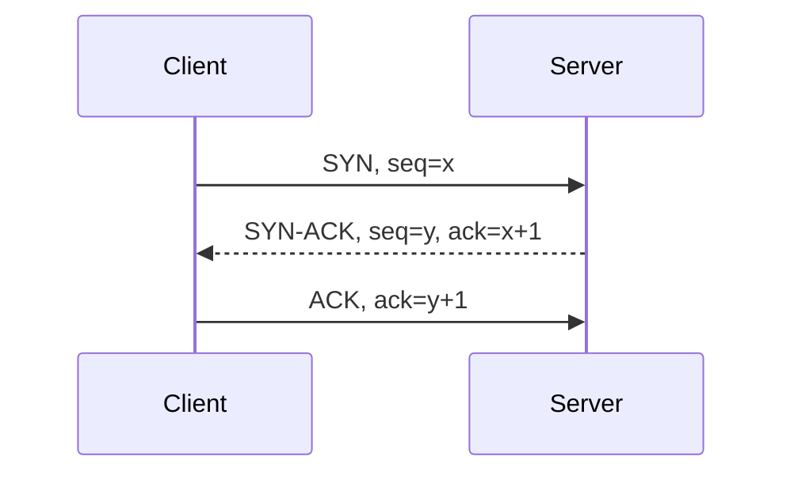

# TCP и UDP

## Транспортный уровень

TCP и UDP переносят данные между процессами на хостах. Для адресации приложений используются порты, а IP отвечает за доставку пакетов между узлами сети.

```text
Application data → TCP/UDP segment or datagram → IP packet
```

## TCP

**TCP** предоставляет надёжный упорядоченный двунаправленный поток байтов.

Основные свойства:

- установление соединения;
- упорядоченная доставка;
- повторная передача потерянных данных;
- обнаружение ошибок;
- удаление дубликатов;
- flow control;
- congestion control;
- отсутствие сохранения границ сообщений.

TCP передаёт поток байтов. Один вызов `send` не обязан соответствовать одному `receive`; прикладной протокол должен определить framing.

## TCP three-way handshake



После handshake стороны согласовали начальные sequence numbers и могут передавать данные.

## Надёжность TCP

Отправитель нумерует байты. Получатель подтверждает полученные данные через ACK. При обнаружении потери TCP повторяет передачу.

Надёжность не означает вечную доставку: соединение может оборваться, timeout истечь, а приложение получить ошибку. Приложению всё равно нужны retries и идемпотентность.

## Flow control и congestion control

**Flow control** защищает получателя: он сообщает, сколько данных готов принять.

**Congestion control** защищает сеть: отправитель меняет скорость на основании признаков перегрузки.

## Head-of-line blocking

TCP предоставляет упорядоченный поток. Если один сегмент потерян, более поздние байты не передаются приложению до восстановления пропуска, даже если уже пришли.

В HTTP/2 несколько streams мультиплексируются в одном TCP-потоке, поэтому потеря может задержать их все.

## UDP

**UDP** передаёт независимые datagrams без установления соединения и не гарантирует:

- доставку;
- порядок;
- отсутствие дубликатов;
- повторную передачу;
- congestion control на уровне базового протокола.

UDP сохраняет границы datagram: одна datagram является отдельным сообщением.

Меньше гарантий означает меньший базовый overhead и возможность приложению самостоятельно выбрать нужные механизмы.

## Сравнение

| TCP | UDP |
| --- | --- |
| Connection-oriented | Connectionless |
| Надёжный упорядоченный поток | Независимые datagrams |
| Retransmission встроен | Retransmission не встроен |
| Flow/congestion control встроены | Реализуются приложением при необходимости |
| Границы сообщений не сохраняются | Границы datagrams сохраняются |
| Чувствителен к HOL blocking | Потеря одной datagram не блокирует следующую на уровне UDP |

## Применение

TCP часто используется для:

- HTTP/1.1 и HTTP/2;
- SSH;
- SMTP;
- подключения к базе данных;
- передачи файлов.

UDP используется для:

- DNS-запросов;
- real-time аудио и видео;
- игр;
- телеметрии;
- QUIC и HTTP/3.

Выбор определяется требованиями. Для голоса лучше потерять отдельный устаревший пакет, чем ждать его повторной передачи и увеличивать задержку.

## QUIC

QUIC работает поверх UDP, но сам реализует:

- надёжную доставку;
- congestion control;
- шифрование через TLS 1.3;
- независимые streams;
- connection migration.

Фраза «HTTP/3 ненадёжный, потому что UDP» неверна: необходимые гарантии реализует QUIC.

## Порты и сокеты

TCP port `443` и UDP port `443` — разные транспортные пространства. Socket обычно идентифицируется сочетанием протокола, локального адреса/порта и удалённого адреса/порта.

## Типичные вопросы

### TCP гарантирует ровно одну доставку?

Он устраняет дубликаты в потоке на транспортном уровне, но приложение может повторить запрос после неопределённого сбоя. Exactly-once бизнес-эффект требует протокола приложения и идемпотентности.

### UDP всегда быстрее TCP?

Не обязательно. У UDP меньше встроенных механизмов, но приложение может реализовать их самостоятельно. Итог зависит от протокола и сети.

### Почему видеозвонки используют UDP?

Низкая задержка важнее гарантированной доставки каждого устаревшего фрагмента. Потери можно скрывать кодеком или компенсировать на уровне приложения.

### В чём разница между stream и message?

TCP передаёт последовательность байтов без границ сообщений. UDP сохраняет границы datagrams.

## Краткий ответ

> TCP даёт надёжный упорядоченный поток с retransmission, flow control и congestion control. UDP передаёт независимые datagrams без гарантий доставки и порядка. TCP удобен, когда важна полнота данных, UDP — когда важны низкая задержка или собственное управление доставкой. QUIC использует UDP как основу, но добавляет надёжность, безопасность и независимые потоки.

## Источники

- [RFC 9293: TCP](https://www.rfc-editor.org/rfc/rfc9293.html)
- [RFC 768: UDP](https://www.rfc-editor.org/rfc/rfc768.html)
- [RFC 9000: QUIC](https://www.rfc-editor.org/rfc/rfc9000.html)

