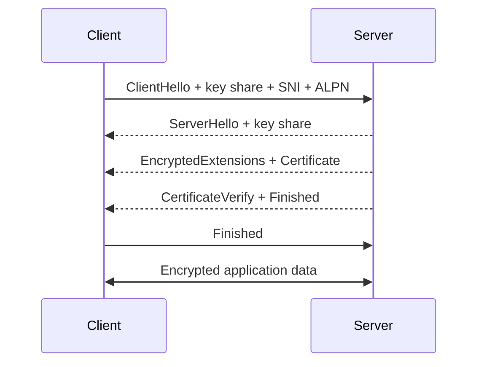

# TLS

## Что такое TLS

**TLS (Transport Layer Security)** создаёт защищённый канал между клиентом и сервером поверх надёжного упорядоченного транспорта. В HTTPS он защищает HTTP-трафик.

TLS обеспечивает:

- **authentication** — подтверждение стороны, обычно сервера;
- **confidentiality** — посторонние не видят содержимое;
- **integrity** — изменение данных обнаруживается.

TLS не скрывает все метаданные: наблюдатель может видеть IP-адреса, объём и время трафика. Раскрытие доменного имени зависит от DNS и используемых расширений TLS.

## Сертификат

Сертификат связывает публичный ключ с именем субъекта и подписывается центром сертификации.

Браузер проверяет:

- срок действия;
- соответствие hostname полям сертификата;
- цепочку до доверенного корневого CA;
- допустимые алгоритмы и назначения ключа;
- статус и политики сертификата, когда применимо.

Сертификат содержит публичный ключ, но не приватный ключ сервера.

## Цепочка доверия

```text
Root CA → Intermediate CA → Server certificate
```

Root CA уже находится в доверенном хранилище клиента. Сервер обычно отправляет свой сертификат и необходимые intermediate-сертификаты.

Self-signed сертификат может шифровать канал, но браузер не может автоматически связать его с доверенной личностью без предварительного доверия пользователя или организации.

## TLS 1.3 handshake

Упрощённая схема:



Во время handshake стороны:

1. согласуют версию и криптографические параметры;
2. выполняют обмен ключевым материалом;
3. сервер доказывает владение приватным ключом сертификата;
4. стороны выводят симметричные session keys;
5. защищают прикладной трафик.

## Асимметричное и симметричное шифрование

Асимметричная криптография используется для аутентификации и установления общего секрета. Основной трафик шифруется симметричными ключами, потому что это значительно эффективнее.

Фраза «HTTPS шифрует всё публичным ключом сервера» неверна.

## Forward secrecy

TLS 1.3 использует эфемерный Diffie–Hellman для обычного публично-ключевого обмена. Компрометация долгосрочного приватного ключа сервера в будущем не должна раскрывать ранее записанные сессии.

## SNI и ALPN

**SNI** сообщает серверу имя хоста, чтобы один IP мог обслуживать разные сертификаты и сайты.

**ALPN** позволяет выбрать прикладной протокол, например HTTP/1.1 или HTTP/2.

Обычный SNI исторически может быть видим наблюдателю. ECH предназначен для шифрования ClientHello-метаданных при поддержке инфраструктурой.

## TLS resumption

Повторное подключение может использовать session ticket или PSK, сокращая число вычислений и задержку handshake.

TLS 1.3 поддерживает 0-RTT early data, но такие данные могут быть повторно воспроизведены атакующим. 0-RTT нельзя без дополнительной защиты использовать для неидемпотентных действий вроде платежа.

## mTLS

При обычном HTTPS сервер аутентифицируется сертификатом, а пользователь — логином, cookie или токеном.

В **mutual TLS** клиент тоже предъявляет сертификат. mTLS применяют в service-to-service коммуникации и корпоративных системах.

## Что TLS не решает

- XSS, SQL injection и ошибки бизнес-логики;
- заражённое устройство клиента;
- утечку на сервере после расшифрования;
- доверие к содержанию сайта;
- сокрытие всех сетевых метаданных.

## Типичные вопросы

### TLS и SSL — одно и то же?

SSL — устаревший предшественник TLS. В разговорной речи «SSL-сертификат» часто означает сертификат для TLS.

### Где хранится приватный ключ?

На стороне владельца сертификата, например сервера или TLS-терминатора. Он не передаётся клиенту.

### Почему используется симметричное шифрование?

Оно быстрее для большого объёма трафика. Асимметричная криптография помогает аутентифицироваться и согласовать секрет.

### Что произойдёт при несовпадении hostname?

Проверка сертификата завершится ошибкой, и браузер покажет предупреждение или заблокирует соединение.

### CDN видит HTTPS-трафик?

Если TLS завершается на CDN, CDN расшифровывает запрос, обрабатывает его и может установить отдельное TLS-соединение с origin. Это нужно учитывать в модели доверия.

## Краткий ответ

> TLS создаёт аутентифицированный, конфиденциальный и целостный канал. В handshake клиент проверяет сертификат сервера, стороны согласуют параметры и получают общий ключевой материал. Прикладной трафик затем защищается быстрым симметричным шифрованием. TLS 1.3 сокращает handshake и обеспечивает forward secrecy, но 0-RTT требует защиты от replay.

## Источник

- [RFC 8446: TLS 1.3](https://www.rfc-editor.org/rfc/rfc8446.html)

